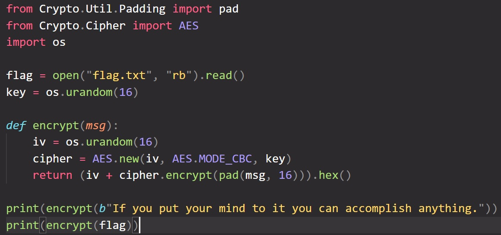
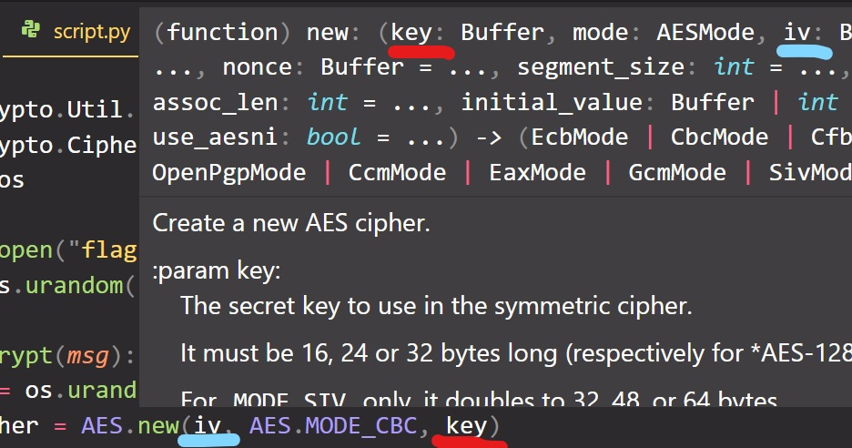
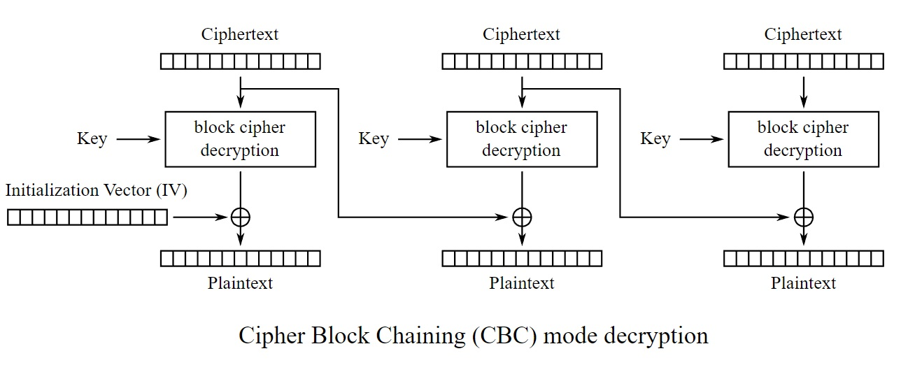

# Cryptography

> Can't remember actual name of challenge

## Description

Given a python [script](script.py) and the ciphertext [output](output.txt), decrypt the original plaintext and find the flag.

## Understanding the code

### The script

At first glance it looks like a normal AES encryption using CBC mode. It returns both the IV (Initialisation Vector) and the ciphertext.

### The output

From here we can see that there are 2 lines of ciphertexts, perhaps they are the output from the 2 print statements in the script?

### What I've discovered
By pure luck (yay), while reading the documentation for python's AES encryption function, I noticed that the `iv` and `key` variables were placed at the wrong positions!  
This is what I found when hovering my cursor over the function:

The `key` was being used as the IV, and the `iv` was used as the key for the encryption!

This is very **important**, as this tells us that what was returned by the `encrypt` function is not `IV + ciphertext`, but instead is `key + ciphertext`.

## Testing things out

### What we have:
1. The **key** used for the encryption
2. Encrypted using CBC mode
3. One of the original plaintext of (the 1st one)
4. The 2 ciphertexts

### What we don't have (and need)
1. The **iv** used for XOR-ing with the plaintext
2. The flag

### Writing the decrypt function
It's not that easy to visualise what is really going on, so I decided to write a decrypt function, and use an IV of a known value `b"0000000000000000"`

Decrypt Attempt 1 (with a random IV):
```py
from Crypto.Cipher import AES

def decrypt(msg:str, iv:bytes):  
    temp = bytes.fromhex(msg)
    key = temp[:16]     # Key is 1st 16 bytes/characters
    ct = temp[16:]      # Ciphertext is the rest of the bytes
    cipher = AES.new(key, AES.MODE_CBC, iv)
    return cipher.decrypt(ct)

iv = b"0" * 16  # Use a random IV for decrypting

# Get the 2 ciphertexts
ct1, ct2 = open("output.txt", "r").read().splitlines()
print(decrypt(ct1, iv))
print(decrypt(ct2, iv))
```

Output:
```
b'\x93\x06\xc5Uw\xa9\xa9x\x04\x1c\xbd:\xbc&\xd4\xd5mind to it you can accomplish anything.\t\t\t\t\t\t\t\t\t'

b'\x924\xa7Wk\xab\xb8#\x12\x00\xae1\xe3c\x87\x88\r\nThat was the flag by the way. Anyway, did you know that the DeLorean time machine is a time travel device made by retrofitting a DMC DeLorean vehicle with a flux capacitor, requires 1.21 gigawatts of power and needs to travel 88 miles per hour (142 km/h) to initiate time travel!\x07\x07\x07\x07\x07\x07\x07'
```

From the output we can observe that the 1st 16 characters of ciphertext are garbage, while the rest of the text are fine. This is due to how the CBC mode encryption works (go search it up).

### How CBC decryption works


As illustrated by the image (which hopefully you can understand), each ciphertext block uses the previous ciphertext block as the IV when decrypting. Except for the 1st ciphertext block, which uses the original IV (which we don't have). This exlains why the text after the 16th character are decrypted correctly.

## Breaking the cipher

### What we have now

Looking at the 1st plaintext, we have these:

The original plaintext
```py
b"If you put your mind to it you can accomplish anything."
```

The ciphertext (in hex form)
```py
"a8f83f932227390f9dc8269522ece02fb37565c4dd334e902a9048e35a923ee3431d67dd676f9175dd89919fb8c542dfdb0a764cfbc87594525799ac827496bd91fa23a66ae1231d5e2e492134bc3e2c"
```

The failed decryption 
```py
b"\x93\x06\xc5Uw\xa9\xa9x\x04\x1c\xbd:\xbc&\xd4\xd5mind to it you can accomplish anything.\t\t\t\t\t\t\t\t\t"
```

The known IV used for the failed decryption
```py
b"0000000000000000"
```

### Getting the IV

A convenient XOR function I got from [stackoverflow](https://stackoverflow.com/questions/29408173/byte-operations-xor-in-python)
```py
# Credits: https://stackoverflow.com/questions/29408173/byte-operations-xor-in-python
def xor(a, b):
    return bytes(i ^ j for i, j in zip(a, b))
```

We first XOR the known IV and the 1st 16 bytes (1st textblock) of the failed decryption, this will give us the decrypted ciphertext before XOR-ing with the IV
```py
# Get decrypted ciphertext before XOR
known_iv = b"0"*16  # Use a known IV for decrypting
decrypted_block = failed_decrypt[:16]
b4_xor = xor(known_iv, decrypted_block)
```

To get the plaintext (`pt`), we will have to XOR this value (`b4_xor`) with the correct `IV`:  `pt = b4_xor ⊕ IV`  
This also means that if we XOR the plaintext and the `b4_xor` we will get the value of the original IV:  `IV = pt ⊕ b4_xor`
```py
# XOR to get the correct IV
pt = b"If you put your mind to it you can accomplish anything."
the_iv = xor(pt, b4_xor)
```

Now that we can get the original IV, we can move on and decrypt the second plaintext to get the flag!

### Flag captured

Solution:
```py
from Crypto.Cipher import AES

# A convinient XOR function I got from stackoverflow
# https://stackoverflow.com/questions/29408173/byte-operations-xor-in-python
def xor(a, b):
    return bytes(i ^ j for i, j in zip(a, b))

def decrypt(msg:str, iv:bytes):  
    temp = bytes.fromhex(msg)
    key = temp[:16]     # Key is 1st 16 bytes/characters
    ct = temp[16:]      # Ciphertext is the rest of the bytes
    cipher = AES.new(key, AES.MODE_CBC, iv)
    return cipher.decrypt(ct)

# Get the ciphertexts
ct1, ct2 = open("output.txt", "r").read().splitlines()

# Attempt to decrypt with a known IV
known_iv = b"0" * 16
failed_decrypt = decrypt(ct1, known_iv)

# Get decrypted ciphertext before XOR
decrypted_block = failed_decrypt[:16]
b4_xor = xor(known_iv, decrypted_block)

# XOR to get the correct IV
pt = b"If you put your mind to it you can accomplish anything."
the_iv = xor(pt, b4_xor)

print(decrypt(ct2, the_iv).decode())
```

Output:
```
HTB{sw1+ch3r00!}
That was the flag by the way. Anyway, did you know that the DeLorean time machine is a time travel device made by retrofitting a DMC DeLorean vehicle with a flux capacitor, requires 1.21 gigawatts of power and needs to travel 88 miles per hour (142 km/h) to initiate time travel!
```

Flag Captured: `HTB{sw1+ch3r00!}`
