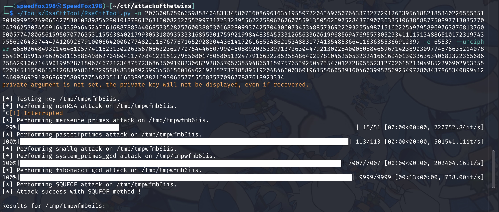
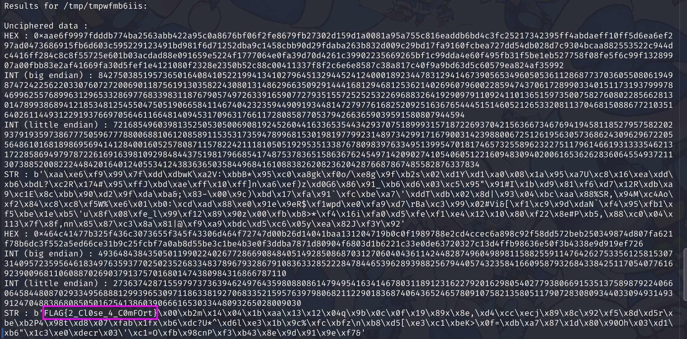

# Attack of the Twins

### Files

- [challenge.txt](challenge.txt) (No actual files were given, this was given as the description of the challenge)

## Challenge Description

_You might have heard of the RSA (Rivest–Shamir–Adleman) asymmetric encryption, which revolves around two prime numbers. RSA is an asymmetric algorithm (having two different keys for encryption and decryptions). The basic reason for this is that it’s quite easy to multiply two prime numbers and find the product. However, it’s a lot harder to find the original two prime numbers using only the product. Especially if the numbers are very big._

_Of course, real RSA is a lot more complicated than this, and there are a few other numbers involved. In fact, RSA is so popular that people have come up with letters for each of the numbers used in RSA._

_A few weeks ago, I had a meeting with a few (fictitious) members of the Cyber Games Circle. Read on to hear what happened._

Mark: We need to set up a challenge for our new members, how about our old RSA game, where we encrypt a secret message for them. Phinley and Quinley, why don’t you start by picking us some nice numbers.

_Twin brothers Phinley and Quinley each write down a number on a piece of paper and pass their papers to Norman._

Norman: Alright, based on what Phinley and Quinley wrote, my number is 20730087506659858404831345807360869616341955072204349750764337327729126339561882185340226555351801099952749065427530103898542801018786126316008252055299731723323955622258062626075591350562697528437690736335106385887750897713035770647962530745691645359464524766168878834406853352825760038853016828099374257043060734534885736922293255498715162225497958969763876813760500577478065619950707763531195638402179930931809393331689530175992199844835455331265633606199685694769557305233411119134886510172319743955620643274447412692679100066420060774822118767767165292830443614172616852486215348831774135485366411636355366912399.

_Norman passes the papers to David._

David: Wow, these are really big numbers. Let’s see, my number is- Mark: Hang on, don’t say it out loud. Your number is a secret, remember? David: Oh, oops. Sorry. Elvis: Ahem. My number, as usual, is 65537. You know that I never pick anything else. Cody: Thanks for your help, everyone. I’ve encrypted the message, and my final number is 6650264849301464610577411523130226356705622362770754446507990450889202533971372630447921300284000608846596714238903097748766352140788541018591576626081158884986270480411777841221512798508017805805122477916632285258486402978104525053232416616940130336363406823223656862584201067145901995287180674672123487572368635091982306829286570573559486511597576539250473547012728055523127026152130498522969029533555203451155061381268394861522958848350892599345615601646219215273738589519204846600360196155660539160460399525692549728084378653408994125460986929198686975809507548235111653895882169306557755568357709677887618923334. Mark: Alright! Let’s see if any of our new members can crack this code. Elvis: Hang on, don’t we need to give them David’s number as well? Otherwise the challenge will be impossible. RSA uses different keys for encrypting and decrypting, remember? Phinley: Not really. I share a lot in common with my twin brother Quinley, so the numbers we picked might have something in common too. Quinley: That could be true. I guess this is what happens when we’re born only two seconds apart.

_Phinley and Quinley share a laugh._

## Solution

We are given `n`, `e` the RSA public key numbers, and `c` the encrypted ciphertext.
First I tried my luck with [factordb.com](http://factordb.com/), which failed to factor `n` into `p` and `q`.

Next, I tired using the [RsaCtfTool](https://github.com/RsaCtfTool/RsaCtfTool). Entering the parameters, and voila we broke the weak RSA (thank you, whoever who made RsaCtfTool).

```
./RsaCtfTool.py -n 20730087506659858404831345807360869616341955072204349750764337327729126339561882185340226555351801099952749065427530103898542801018786126316008252055299731723323955622258062626075591350562697528437690736335106385887750897713035770647962530745691645359464524766168878834406853352825760038853016828099374257043060734534885736922293255498715162225497958969763876813760500577478065619950707763531195638402179930931809393331689530175992199844835455331265633606199685694769557305233411119134886510172319743955620643274447412692679100066420060774822118767767165292830443614172616852486215348831774135485366411636355366912399 -e 65537 --uncipher 6650264849301464610577411523130226356705622362770754446507990450889202533971372630447921300284000608846596714238903097748766352140788541018591576626081158884986270480411777841221512798508017805805122477916632285258486402978104525053232416616940130336363406823223656862584201067145901995287180674672123487572368635091982306829286570573559486511597576539250473547012728055523127026152130498522969029533555203451155061381268394861522958848350892599345615601646219215273738589519204846600360196155660539160460399525692549728084378653408994125460986929198686975809507548235111653895882169306557755568357709677887618923334
```

Running the RsaCtfTool:  
  


Flag Captured: `FLAG{2_Cl0se_4_C0mFOrt}`

## Intended solution

According to the creator, the intended solution was to find the prime numbers `p` and `q` given that the difference of the two numbers is of the value 2. `|p - q| = 2`

The hint to this properties of the two prime numbers were given in the last paragraph in the challenge question.
> Phinley: Not really. I share a lot in common with my twin brother Quinley, so the numbers we picked might have something in common too. Quinley: That could be true. I guess this is what happens when we’re born only two seconds apart.
