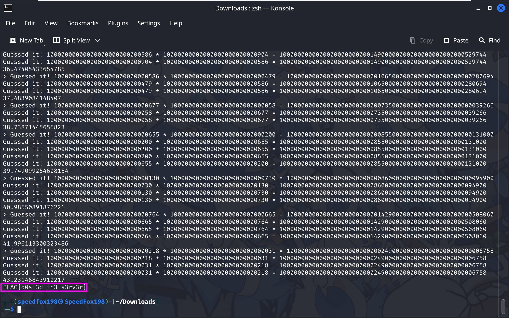

# DOS

### Files

- [run.py](run.py)

## Challenge Description

Break me!

> nc vm2.gabrielseet.com 1342

## Analysing the code

We were given a python file [run.py](run.py), and an `nc` command. When connected to the server, the same python file would be run there.

Reading through the python code, we could figure out what this program is doing:
1. There are 2 modes to choose from for every iteration through the while loop:
    1. Mode 1: Add a card (number) into the `cards` list
    2. Mode 2: Choose two random cards from the `cards` list and find their product, iterate through the `cards` list and bruteforce to find the two original randomly chosen cards.
2. For every operation that is done in each mode, the time taken (in seconds) for the operation to run is added cumulatively into variable `t`.
3. After 1000 iterations (base on the `count` variable), the while loop will end.
4. At the end of the while loop, if the value of `t` is greater than 20, the flag will be printed out.

So from this (and also suggested by the name of this challenge), we can get our flag if we make the code take longer than 20 seconds in total to execute.

The part that caught my interest is these lines of code in choice 2:
```py
n = cards[random.randint(0, len(cards) - 1)] * cards[random.randint(0, len(cards) - 1)]
for i in cards:
    for j in cards:
        if i * j == n:
            print(f'Guessed it! {i} * {j} = {n}')
```

The nested for loop here will be the key to our DOS attack. A nested for loop will mean that the time complexity to finish this part of the script would be `O(n^2)` where `n` is the length of the list `cards`. Now that's great, because a quadratic time complexity code takes a long time to run.

Also the calculation of `i * j` will be very costly if the numbers are very huge.

So all we have to do, is to add a lot of extremely **large** integers into the `cards` list using choice 1, and then run choice 2 enough number of times such that `t` will be greater than 20.

> `print` statements are also very very costly, however the hosted script probably didn't use print statements.

## Solution

I wrote a [python script](solution.py) for this:
```py
import random

n = 10000000000000000000000000000

for i in range(999-111):
    print(1)
    print(random.randint(n,n + 1000))

for i in range(1+111):
    print(2)
```

> As mentioned before, print statements are too costly, to prevent my local test from taking too long to run due to the print statements, i used `random` to prevent multiple prints in one iteration.

After ensuring that our script works on our local [run.py](run.py). It's time to pipe our script's output to the server:
```
python solution.py | nc vm2.gabrielseet.com 1342
```

Output:  


> For some reason the script on the server ran quite slowly and crashes frequently, I had to decrease the value of `n` from and fine tuned the number of times each choices (1 and 2) are being run to make sure that it takes slightly more than 20 seconds to run when connected to the server. The solution I used here would only run for around 17 seconds locally on [run.py](run.py) (when I last tested it).

Flag Captured: `FLAG{d0s_3d_th3_s3rv3r}`
