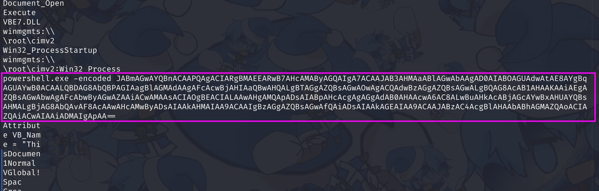
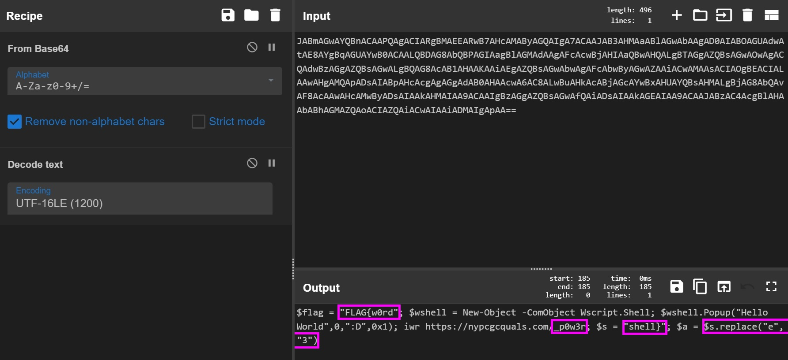

# Homework

### Files

- [Homework.zip](Homework.zip)
    - Homework.doc

> Your antivirus will most likely delete the `Homework.doc`, so view it in your virtual machine instead

## Challenge Description

We received our daily email from our teacher about our homework but it looks different today :(

## Solution

First thing I did was to run `strings` on the file:  

This powershell code looks very interesting. It looks like a base64 code, let's decode it using [CyberChef](https://gchq.github.io/CyberChef/#recipe=From_Base64('A-Za-z0-9%2B/%3D',true,false)Decode_text('UTF-16LE%20(1200)')&input=SkFCbUFHd0FZUUJuQUNBQVBRQWdBQ0lBUmdCTUFFRUFSd0I3QUhjQU1BQnlBR1FBSWdBN0FDQUFKQUIzQUhNQWFBQmxBR3dBYkFBZ0FEMEFJQUJPQUdVQWR3QXRBRThBWWdCcUFHVUFZd0IwQUNBQUxRQkRBRzhBYlFCUEFHSUFhZ0JsQUdNQWRBQWdBRmNBY3dCakFISUFhUUJ3QUhRQUxnQlRBR2dBWlFCc0FHd0FPd0FnQUNRQWR3QnpBR2dBWlFCc0FHd0FMZ0JRQUc4QWNBQjFBSEFBS0FBaUFFZ0FaUUJzQUd3QWJ3QWdBRmNBYndCeUFHd0FaQUFpQUN3QU1BQXNBQ0lBT2dCRUFDSUFMQUF3QUhnQU1RQXBBRHNBSUFCcEFIY0FjZ0FnQUdnQWRBQjBBSEFBY3dBNkFDOEFMd0J1QUhrQWNBQmpBR2NBWXdCeEFIVUFZUUJzQUhNQUxnQmpBRzhBYlFBdkFGOEFjQUF3QUhjQU13QnlBRHNBSUFBa0FITUFJQUE5QUNBQUlnQnpBR2dBWlFCc0FHd0FmUUFpQURzQUlBQWtBR0VBSUFBOUFDQUFKQUJ6QUM0QWNnQmxBSEFBYkFCaEFHTUFaUUFvQUNJQVpRQWlBQ3dBSUFBaUFETUFJZ0FwQUE9PQ):  

> We have to decode it using UTF-16 too

We can see that there are bits of the flag here and there, combine them together, and we'll have our flag.

> Make sure to replace the `"e"` in `"shell}"` with `"3"`

Flag Captured: `FLAG{w0rd_p0w3rsh3ll}`
