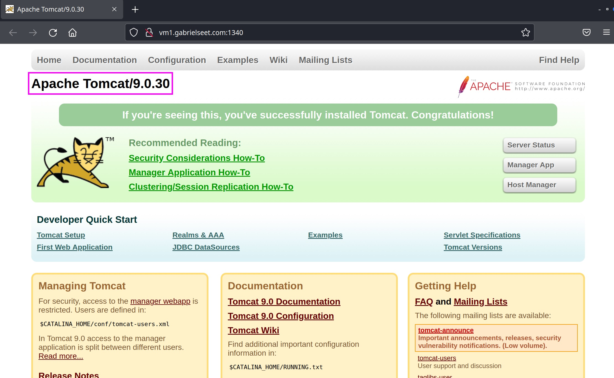
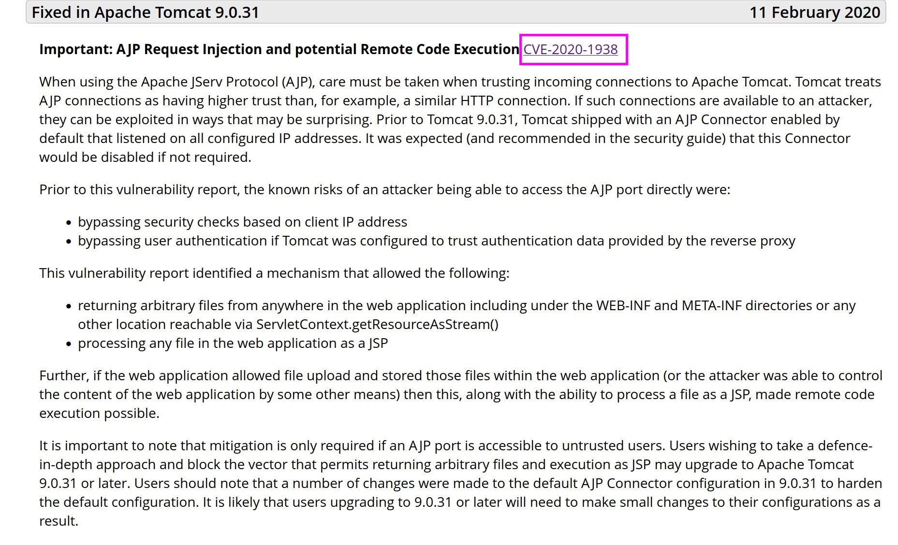
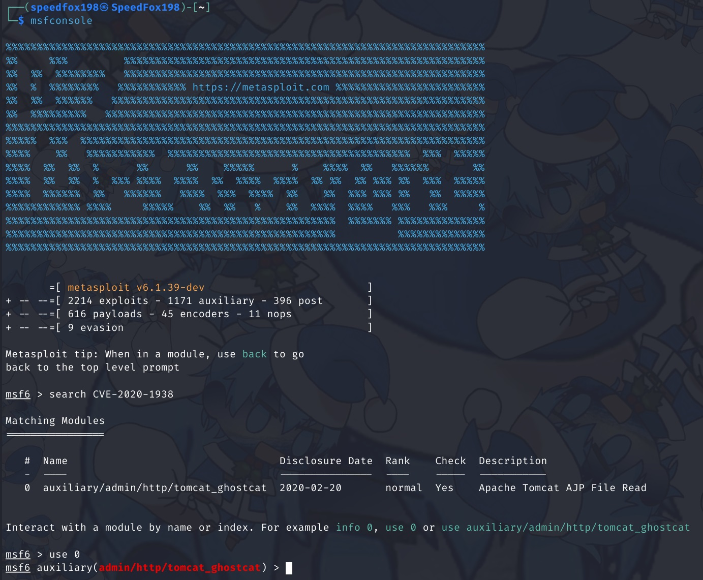
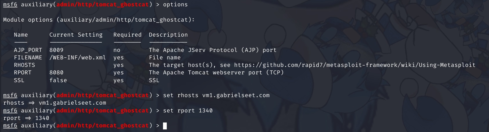
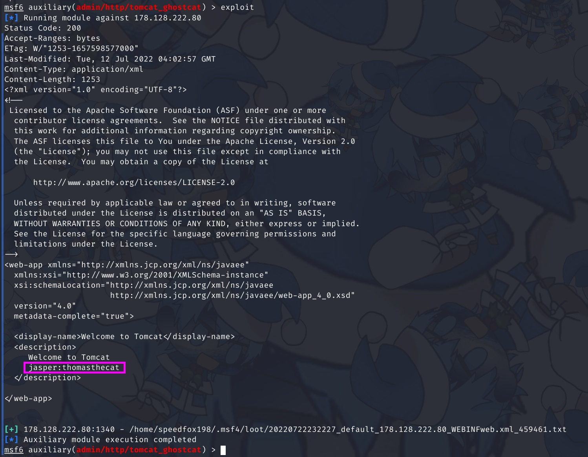
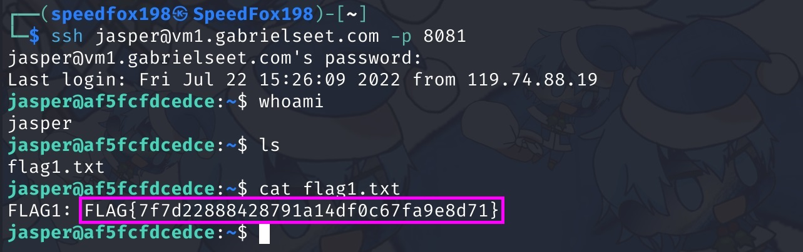
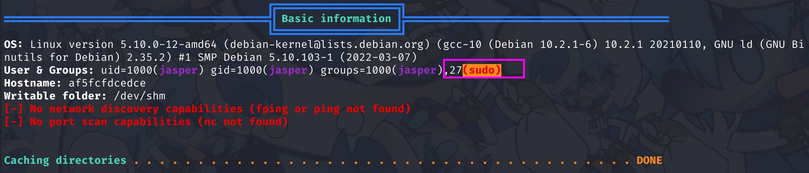
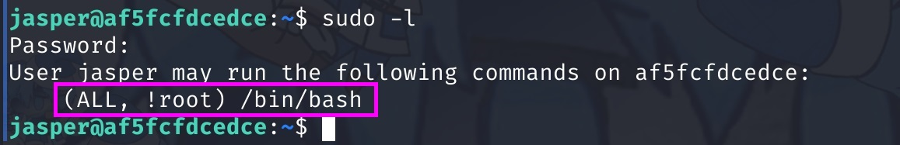
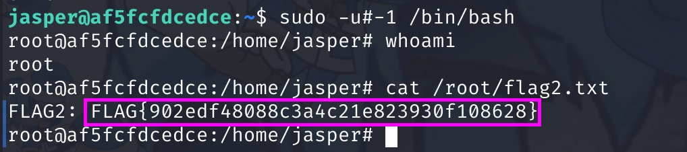

# Tom and Jerry

> _Failed to solve this during the CTF QAQ_

## Challenge Description

Thomas is on a mission to capture Jerry. First stop /WEB-INF/web.xml

Flag 1 is located at /home/flag1.txt

Flag 2 is located at /root/flag2.txt

Note: Replace user to the user you have gained access to

SSH server is on port 8081. You are not allowed to/required to bruteforce the SSH Server

## Initial Look

The challenge is a web challenge hosted on http://vm1.gabrielseet.com:1340/


We can see that this is an Apache Tomcat of version `9.0.30`

Let's see if we can find some vulnerability to exploit:  


So we found this vulnerability `CVE-2020-1938` in version `9.0.30`, which was patched in version `9.0.31`

> In the challenge description, we were given a hint that our "first stop" is in `/WEB-INF/web.xml`

## Getting the first flag

Let's start up `msfconsole`, search for `CVE-2020-1938` and use it:  


Set the values of the target host and port number:

> We are trying to get the file `/WEB-INF/web.xml`, conveniently the deafult value is set to that so we don't need to set it



Run the exploit and see what's in the file:  


The xml file has the user's credentials in it. Time to connect to it via SSH on port 8081:  


Flag 1 Captured: `FLAG{7f7d22888428791a14df0c67fa9e8d71}`

## Getting the second flag

According to the challenge description, the flag 2 is located in the root's home directory (which we don't have access to)

Time to do some privilege escalation.

Running [LinPEAS](https://github.com/carlospolop/PEASS-ng/tree/master/linPEAS):  


We immediately get some very interesting results. Based on this output, our current user `jasper` might be able to use the `sudo` command.

Let's see what we are allowed to run with the `sudo` command:  


`jasper` is able to run `/bin/bash` using `sudo`!

Searching online on "sudo /bin/bash exploits" shows that there is a vulnerability `CVE-2019-14287` that allows privilege escalation.

A payload that exploits this from [PayloadsAllTheThings](https://github.com/swisskyrepo/PayloadsAllTheThings/blob/master/Methodology%20and%20Resources/Linux%20-%20Privilege%20Escalation.md#cve-2019-14287):
```
sudo -u#-1 /bin/bash
```

Let's run our payload:  


Flag 2 Captured: `FLAG{902edf48088c3a4c21e823930f108628}`
