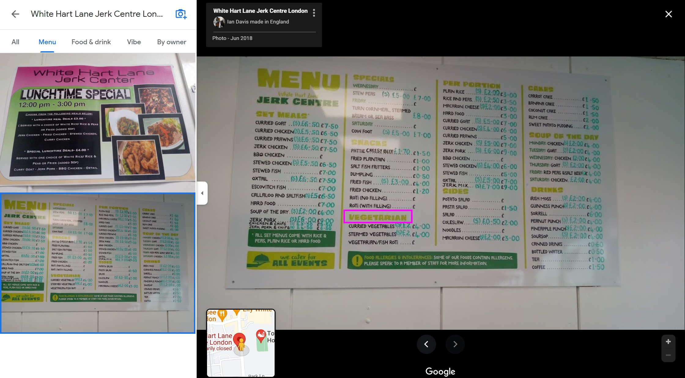

# What's For Lunch?

### Files

- [Whats_for_Lunch_Chat_Export.pdf](./Whats_for_Lunch_Chat_Export.pdf)

## Challenge Description

The Cyber Games Circle is having it's first (fictional) overseas excursion! After a fun morning of flag-finding, it's time for lunch! Your teammates have found a place to eat at, do you know where it is? To prove that you do, give us the phone number of the place.

Submit your answer in the format FLAG{phone number}. Be sure to add the country code extension (e.g. +65). For example, the flag could be FLAG{+123456789012}.

## The first image

We are given a PDF file and are tasked to find the phone number of the described restaurant.

Let's analyse our first clue (the first image):  

A lot of interesting details, what I immediately noticed was the words "ESTABLISHED 1882". I also took notice of an interesting icon on the wall (A bird standing on a ball). I did a very naive search using the keywords `"Established 1882 Bird on a ball"`. Very unexpectedly, it actually yielded great results!  

It was the logo of a football club! Let's search for a building that's related to it! Turns out the building in question is the Tottenham Hotspur Stadium located in London. I then used google maps, went into street view and found the location where the image was taken:  

## The second image

The second image was an image taken in the "Chips Town" restaurant just across the road

## Our third clue

Now our task is to find a Jamaican restaurant with vegetarian options. I first thought it was this restaurant. It fits all the description, it is Jamaican, it is just further down the road, and it even has vegetarian options:  
  

Unfortunately, this wasn't the correct restaurant. I should have taken a hint when the store was marked as "Temporarily closed".

> After some searching, turns out Jamaican is situated in the Caribbean

There's another store that also fits the criteria:  
  

Flag Captured: `FLAG{+442083659905}`

## Alternatives

1. Someone solved it as they recognised that this was a stadium, and searched `"Stadium established 1882"` (There was some soccer fans who recognised the logo)
2. A genius took note that the only overseas english country that he could think of where cars keeps to the left lane is in the UK, and he managed to find the location based on that. (big brain)
3. One of my friends found the location by using Google Lens, such a simple yet effective method!

