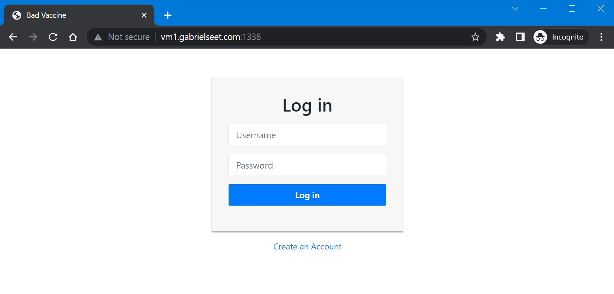
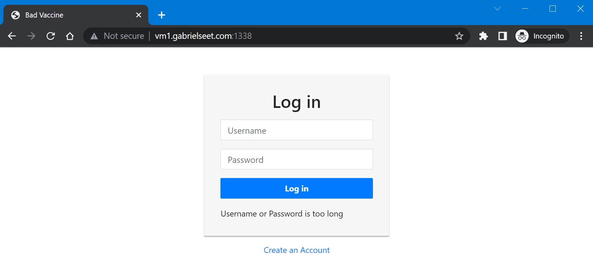
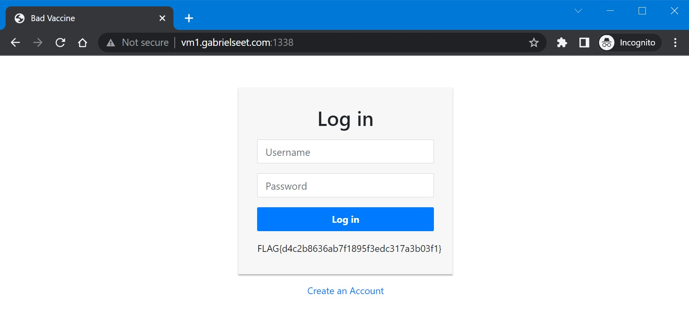

# ezVaccine

## Challenge Description

Latest news report that the 4th dose of vaccine is ready. Can you hack this page and verify it?

## Let's do this

In this web challenge we are given a simple login page.  


First thing I do when I see a login page? Attempt to inject SQL code (´∀｀)  
Entering a single quote `'` in the username field gets us an Internal Server Error. Great! The site is SQL injectable.


Time to inject code, I used the most classic SQL injection code:
```
' or 1=1 --
```

Oh dear! What is this?  


Ok, apparently there's a length limit set to this input. After testing a little bit, the maximum length allowed for both the username and password inputs is 8 characters.

Modified our code to make it 8 characters:
```
'or 1 --
```

Let's try that again:  


Interesting, it's even blacklisted some characters. After a few more tries, I found that these characters are being blacklisted: `=` `-` `;`

To help me with creating the code for injection, I tried to see what the actual SQL query might look like:

```sql
SELECT * FROM Users WHERE username='$username' AND password='$password';
```

In the end, I came up with this code that will be within 8 characters and does not contain any of the blacklisted characters:

In the username field:
```
'or
```

In the password field:
```
or 1 or'
```

The resulting SQL query will look like this:
```sql
SELECT * FROM Users WHERE username=''or' AND password='or 1 or'';
```

Let's test it out:  


Nice, it worked!

Flag Captured: `FLAG{d4c2b8636ab7f1895f3edc317a3b03f1}`
