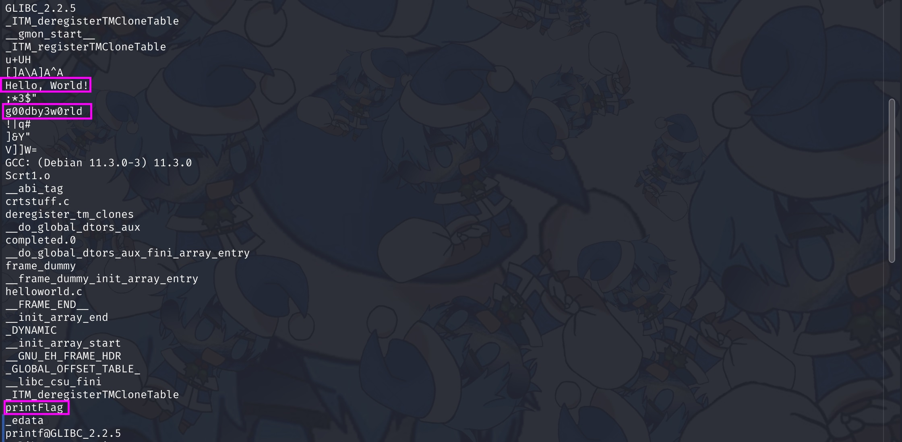
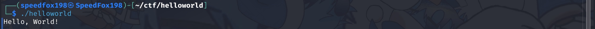
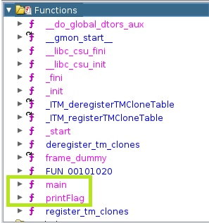
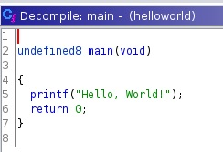
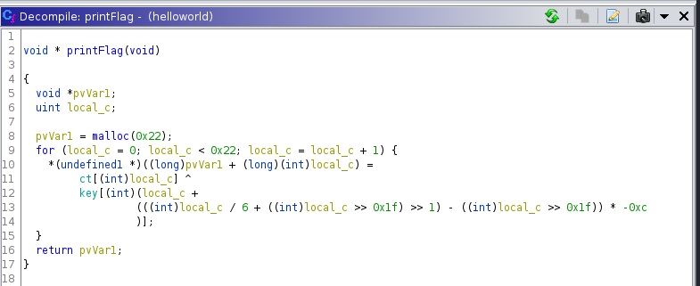
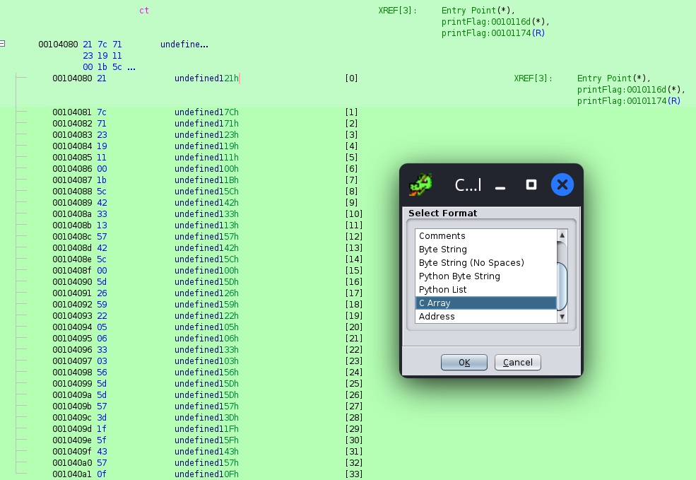
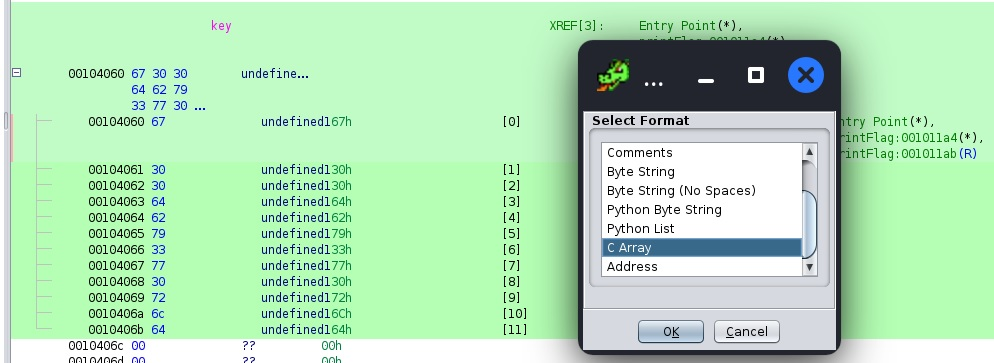
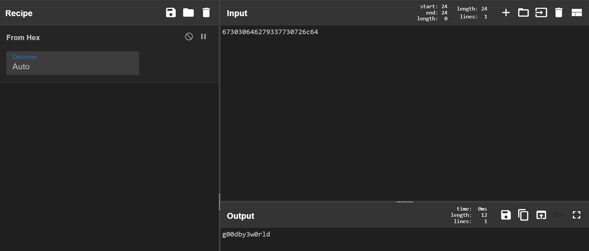
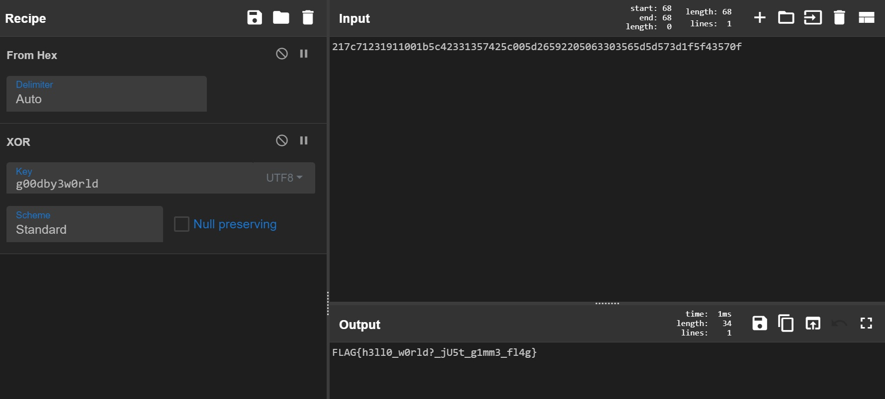

# helloworld

### Files

- [helloworld](helloworld)

## Challenge Description

why do people like greeting the world so much

## Initial Steps

First thing I did was to `strings` the file to see if there was anything of interest:  


We did find some interesting strings, among them the most intersting one was the string `printFlag`, might it be the name of a function that prints out the flag?

Let's run the executable to see what does it do:  


Hmm... It just prints out "Hello, World!", nothing much.

Let's start up Ghidra and decompile the code. After creating a project and decompiling the code, I took a look at the functions:  


We are most interested in the `main` and `printFlag` functions.

Looking at the `main` function:  


Turns out the program really doesn't do much at all, all the `main` function does is printing "Hello, World!".

Now, let's look at the `printFlag` function:  


The function does an XOR operation on the variable `ct` using the variable `key`. The return value is most likely the decrypted flag.

By double clicking on the `ct` and `key` variables in Ghidra, I can go to where they are stored in the binary and copy their values.  
  


`ct`:
```c
{ 0x21, 0x7c, 0x71, 0x23, 0x19, 0x11, 0x00, 0x1b, 0x5c, 0x42, 0x33, 0x13, 0x57, 0x42, 0x5c, 0x00, 0x5d, 0x26, 0x59, 0x22, 0x05, 0x06, 0x33, 0x03, 0x56, 0x5d, 0x5d, 0x57, 0x3d, 0x1f, 0x5f, 0x43, 0x57, 0x0f }
```

`key`:
```c
{ 0x67, 0x30, 0x30, 0x64, 0x62, 0x79, 0x33, 0x77, 0x30, 0x72, 0x6c, 0x64 }
```

I then proceed to rewrite the `printFlag` function in C++ ([solution.cpp](solution.cpp)):
```c++
#include <iostream>

int main()
{
    int ct[] = { 0x21, 0x7c, 0x71, 0x23, 0x19, 0x11, 0x00, 0x1b, 0x5c, 0x42, 0x33, 0x13, 0x57, 0x42, 0x5c, 0x00, 0x5d, 0x26, 0x59, 0x22, 0x05, 0x06, 0x33, 0x03, 0x56, 0x5d, 0x5d, 0x57, 0x3d, 0x1f, 0x5f, 0x43, 0x57, 0x0f };
    int key[] = { 0x67, 0x30, 0x30, 0x64, 0x62, 0x79, 0x33, 0x77, 0x30, 0x72, 0x6c, 0x64 };
    int var {};
    int i {};
    for (i = 0; i < 0x22; i++) {
        var =
        ct[i] ^
        key[(i +
                ((i/6 + (i >> 0x1f) >> 1) -
                (i >> 0x1f)) * -0xc
            )];
        printf("%c", var);
    }
    return 0;
}
```

Compiling and running the code using `G++`:
```
FLAG{h3ll0_w0rld?_jU5t_g1mm3_fl4g}
```

Flag Captured: `FLAG{h3ll0_w0rld?_jU5t_g1mm3_fl4g}`

## Intended Solution

Remember the "g00dby3w0rld" string I found when running `strings` on the executable? Turns out this string was actually the key.

Decoding the hex to string in [CyberChef](https://gchq.github.io/CyberChef/#recipe=From_Hex('Auto')&input=NjczMDMwNjQ2Mjc5MzM3NzMwNzI2YzY0):


The complicated-looking printFlag function was because decompiled code would not be exactly the same as the original code. The intended solution was just to perform an XOR on the `ct` using the `key`

Here's me trying that out in [CyberChef](https://gchq.github.io/CyberChef/#recipe=From_Hex('Auto')XOR(%7B'option':'UTF8','string':'g00dby3w0rld'%7D,'Standard',false)&input=MjE3YzcxMjMxOTExMDAxYjVjNDIzMzEzNTc0MjVjMDA1ZDI2NTkyMjA1MDYzMzAzNTY1ZDVkNTczZDFmNWY0MzU3MGY):

