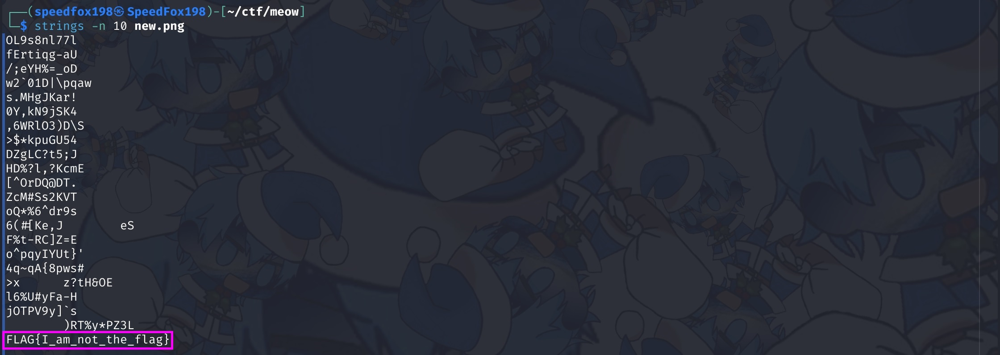
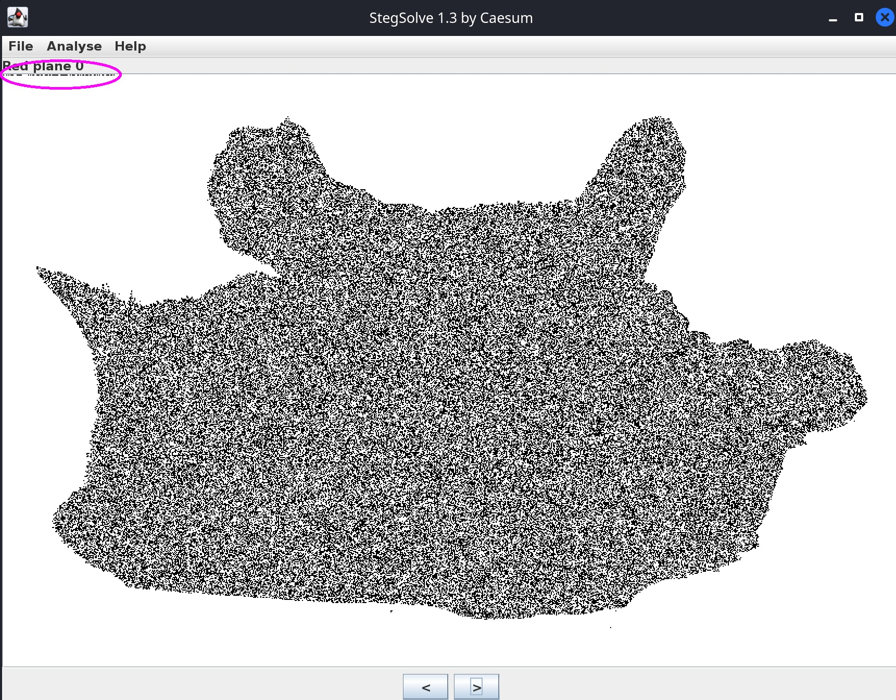
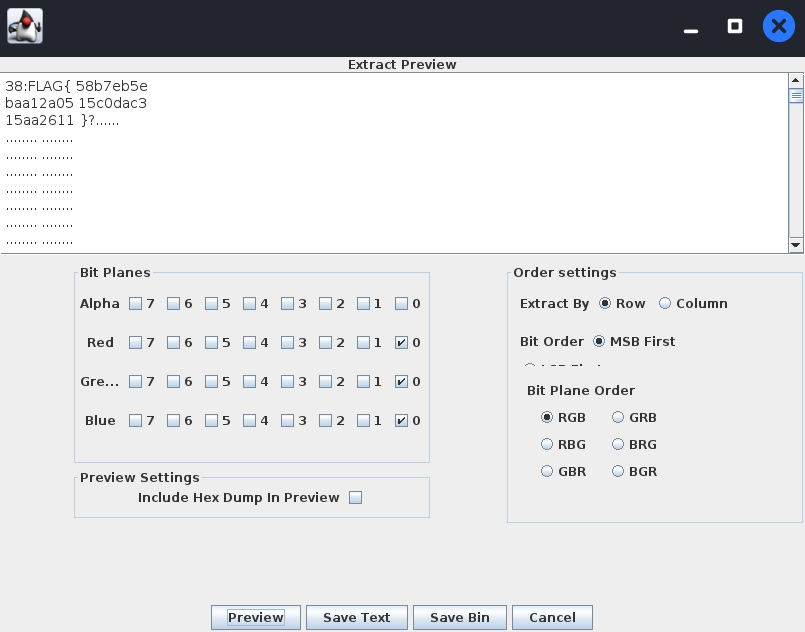

# meow

### Files
- [challenge.zip](challenge.zip)
    - [new.png](original.png)
    - [original.png](original.png)

## Challenge Description

meow what a cute cat

## Solution

First I ran strings on `new.png` and funnily enough, whoever who created this challege decided to pull a prank on us.  

~~Flag Captured: `FLAG{I_am_not_the_flag}`~~  
Nahh that wasn't the flag.

`exiftool` revealed nothing interesting to us, so i ran [stegsolve](https://github.com/zardus/ctf-tools/blob/master/stegsolve/install) to analyse the image. When viewing the colour panes, you could see that the first few bits of the 0th bit planes of each rgb colour are hiding someting.  

Using the data extract function, I selected the 0th bits of red, blue, and green. Scroll to the top of the priview and there's our flag.  

Flag Captured: `FLAG{58b7eb5ebaa12a0515c0dac315aa2611}`
