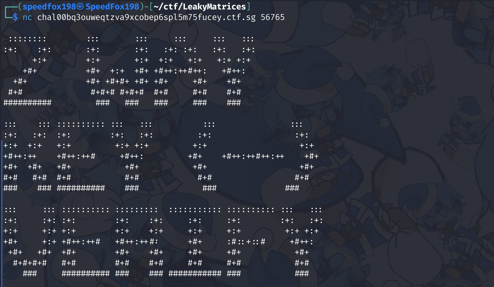
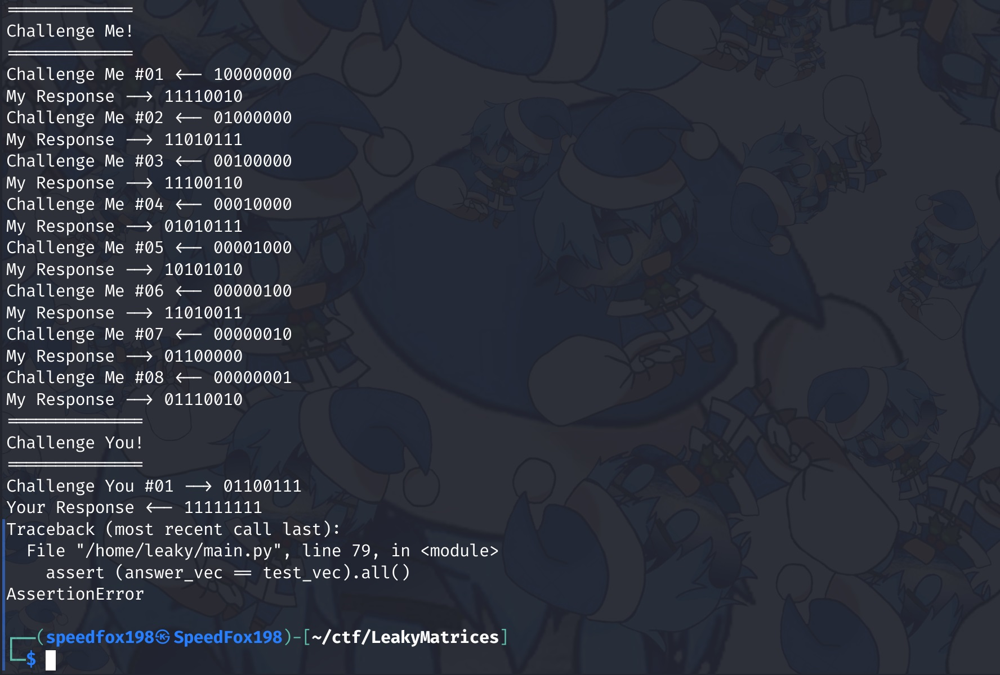
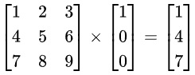
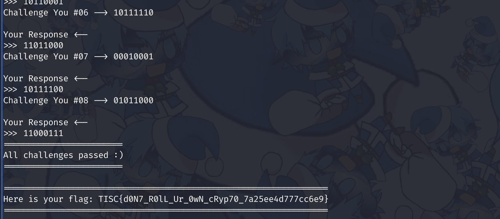

# Leaky Matrices

### Files

- [2WKV_Whitepaper.pdf](./2WKV_Whitepaper.pdf)

## Challenge Description

Topic: Cryptography

Looks like PALINDROME implemented their own authentication protocol and cryptosystem to provide a secure handshake between any 2 services or devices. It does not look secure to us, can you take a look at what we have got?

Try to fool their authentication service: nc chal00bq3ouweqtzva9xcobep6spl5m75fucey.ctf.sg 56765

## Analysing the code

The whitepaper tells us this:
- During the challenge phase, the only allowed inputs are
    - A string of length **8**
    - A string containing only **0**s and **1**s
- The response returned will also only be **0**s and **1**s as the results are passed through a bitwise AND operator (`&`) with `1`

The server hosts a python file that does the same thing as the file in the pdf:  
  

In the CHALLENGE ME phase, the server will response according to the algorithm. After that in the CHALLENGE YOU phase, entering a wrong matrix will end the program.

## Solution

Just like the name of the challenge suggests, the response leaks too much information about the secret matrix. We can figure out the secret key (matrix) by passing in some special matrices during the CHALLENGE ME phase.

Multiplying the secret matrix with a matrix with all **0**s and one **1** will reveal the respective column of the secret matrix.

For example (3x3 matrix):  

So I wrote a [script](script.py) to crack the secret key and calculate the correct responses using the leaked secret key:  

Flag Captured: `TISC{d0N7_R0lL_Ur_0wN_cRyp70_7a25ee4d777cc6e9}`
