# PATIENT0

### Files

- [PATIENT0](PATIENT0)

## Part 1
### Challenge Description

Topic: Forensics

Palindrome has spread some virus to corrupt machines causing incorrect readings in patients' health measurements and rending them unusable. Inspect the file and see if you can uncover the 8 corrupted bytes that renders the file system unusable?

Submit your flag in this format: TISC{last 4 bytes in 8 lowercase hex characters}

## Analysing the file

Checking the file type with `file` reveals the type of file we are dealing with:  

Let's open the file in FTK Imager:  
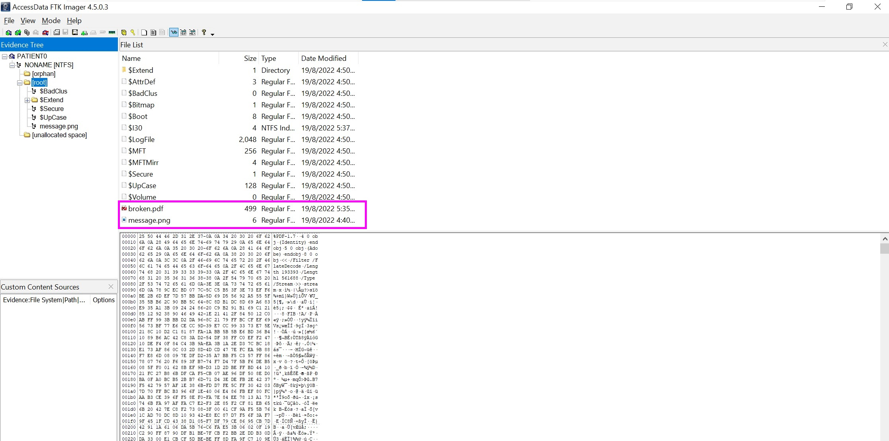

We see few interesting files in the root directory: `broken.pdf` and `message.png`

Opening `broken.pdf`:  
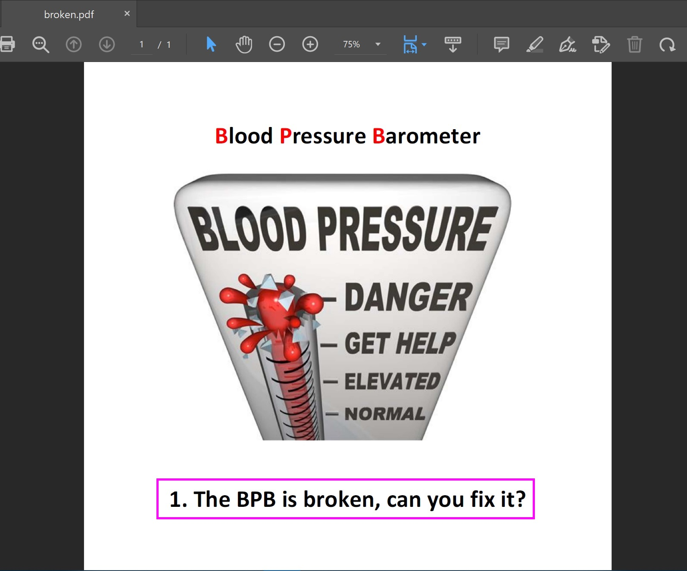

Here we get our first clue: `1. The BPB is broken, can you fix it?`  
There's also a lot of hintings in the image telling us that "BPB" is of interests.

After some searching, it turns out that BPB is the short form for [BIOS parameter block](https://en.wikipedia.org/wiki/BIOS_parameter_block).

In NTFS, the BPB can be found in the [Partition Boot Sector](https://en.wikipedia.org/wiki/NTFS#Partition_Boot_Sector_(PBS))

## Solution

Inspecting the hex of the [PATIENT0](PATIENT0) file, we could see that there's 8 bytes in the PBS that does not belong there:  
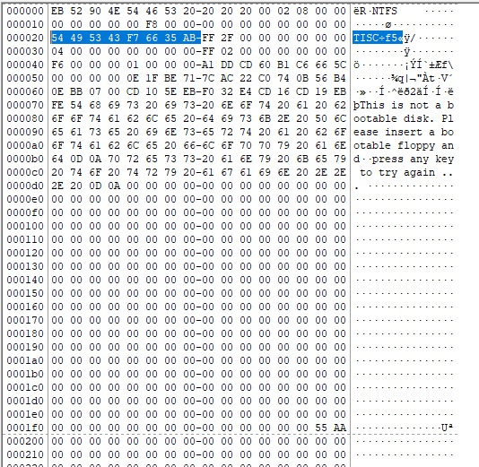

> Also the text `TISC` should've made it very obvious, I was blind enough to only find it after 1 whole day (╯°□°)╯︵ ┻━┻

Taking the hex values of the last 4 bytes and we have our flag!

Flag Captured: `TISC{f76635ab}`

## Part 2
### Challenge Description

Topic: Forensics

Palindrome must have leaked one of their passwords as the 4 corrupted bytes (Part 1 flag)! Dig deeper to find what was hidden!

Submit your flag in this format: TISC{md5 hash} <-- will be prompted only after opening hidden room.

Note: Please ignore the word 'original' in clue 4.

## Finding the next clues

Moving on to the `message.png` found previously:  
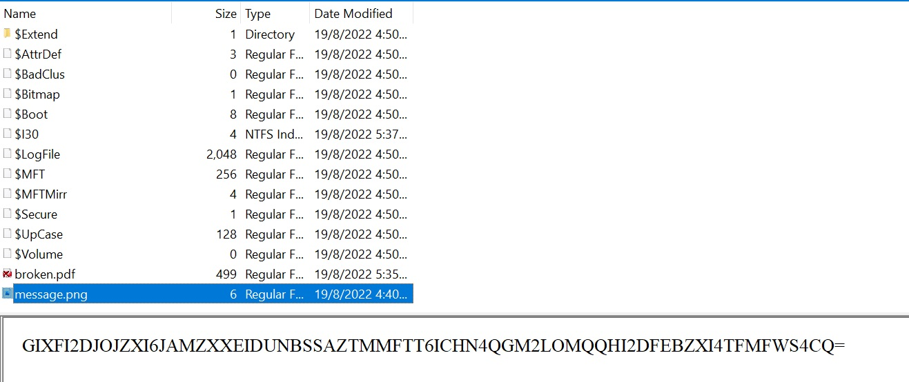

Decoding the base32 message in the image gave us our 2nd clue:  
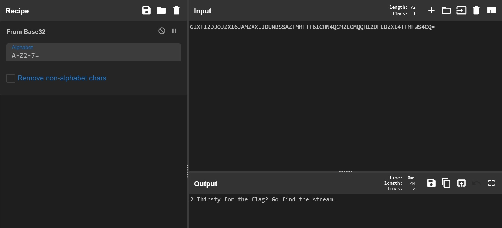

Clue 2: `2. Thirsty for the flag? Go find the stream.`

Clue 2 hints that there are something hidden in a data stream. Clicking into the image in FTK Imager shows that the image contained an Alternate Data Stream with our next clue:  
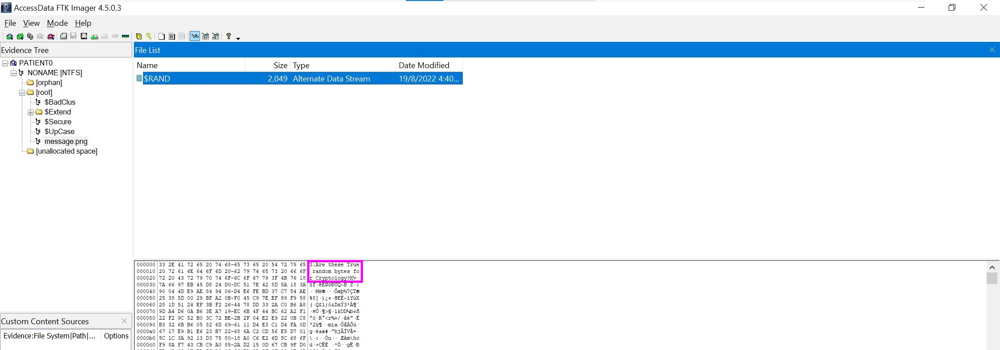

Clue 3: `3. Are these True random bytes for Cryptology?`

Scrolling down to the bottom shows us a 4th clue encoded in UTF-16:  
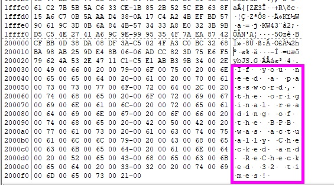

Clue 4: `4. If you need a password, the reading of the BPB was actually Checked and ReChecked 32 times!`

## Getting to the outer door

Clue 3 apparently hinted that the random bytes that are following is actually encrypted using [TrueCrypt](http://truecrypt.sourceforge.net/) software.

Decrypting and mounting the extrated bytes (using part 1's flag as password):  
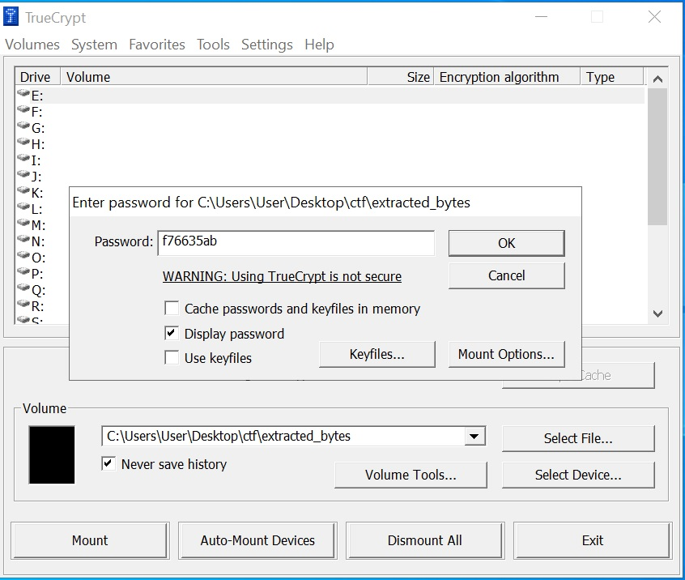  
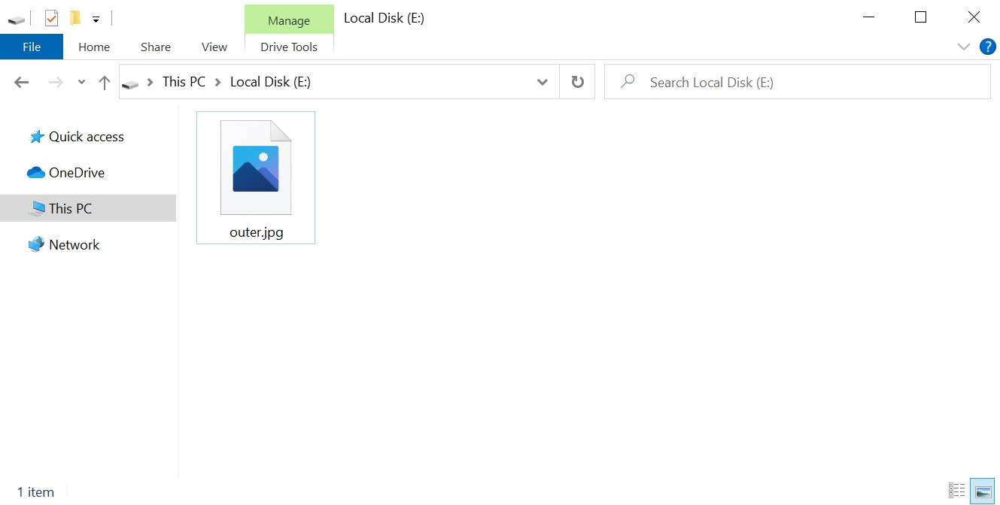  

## Unlocking the outer door

The mounted drive has an image that tells us to find the secret password that resembles the word "collision" (hinted by the phrase "hash collision")

Looking back at clue 4, `4. If you need a password, the reading of the BPB was actually Checked and ReChecked 32 times!`. The capitalised characters hints that the value of our 1st flag (`f76635ab`) is the secret password hashed using CRC32 algorithm.

After searching ~~forever~~ I found a python script that finds for CRC32 hash collisions.

After modifying the script (from line 339) the [new script](script.py) finds for a 9-bytes string starting with `c` and `n` that has a collision with the value `f76635ab`:  
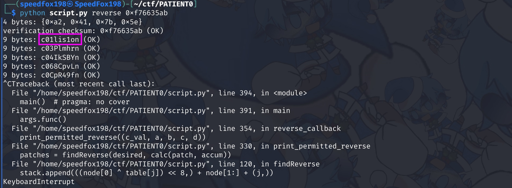

The first collision found was secret key: `c01lis1on`

Once again decrypting and mounting the extrated bytes, this time using `c01lis1on` as the password:  
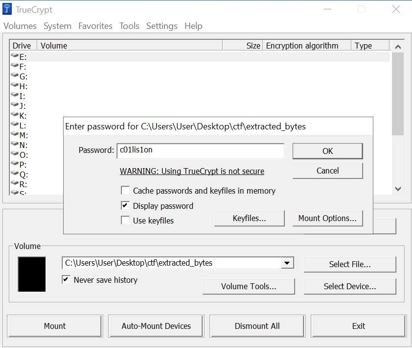  
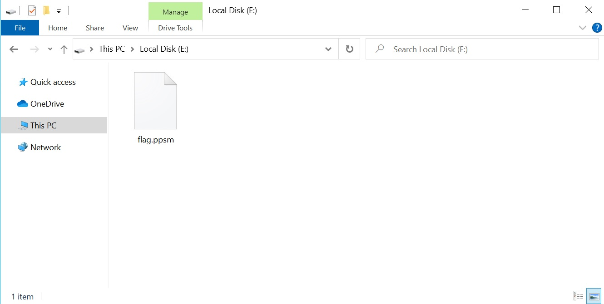

We get a `flag.ppsm` powerpoint slideshow file that plays an audio when you open it.  

The upside down text reads `TISC{md5 hash of sound clip}`.

Extracting the sound file using 7zip and getting the MD5 hash of the file:  
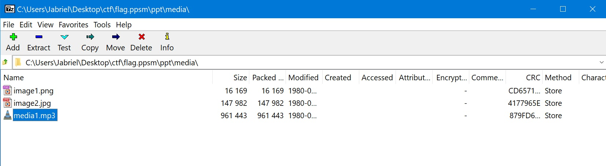  

Flag Captured: `TISC{f9fc54d767edc937fc24f7827bf91cfe}`
