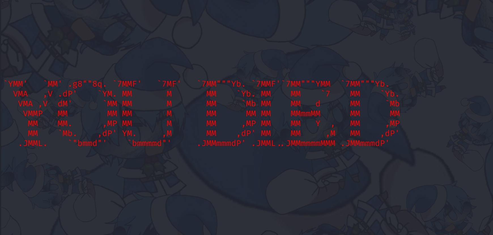

# Slay The Dragon

### Files

- [slay_the_dragon.zip](slay_the_dragon.zip)

## Challenge Description

Topic: Pwn

The recently launched online RPG game "Slay The Dragon" has been hot topic in the online gaming community of late, due to a seemingly impossible final boss. Amongst the multiple tirades against the forementioned boss, much controversy has been brewing due to rumors of the game being a recruitment campaign for PALINDROME, the cybercriminal organisation responsible for recent cyberattacks on Singapore's critical infrastructure.

You are tasked to find a way to beat (hack) the game and provide us with the flag (a string in the format TISC{xxx}) that would be displayed after beating the final boss. Your success is critical to ensure the safety of Singapore's cyberspace, as it would allow us to send more undercover operatives to infiltrate PALINDROME.

To aid in your efforts, we have managed to obtain the source code of the game for you. We look forward to your success!

You will be provided with the following:

1. Source code for game client/server (Python 3.10.x)
2. Game client executable (Compiled with PyInstaller)
- Highly recommended that you run it in a modern terminal (not cmd.exe) for the optimal experience:
- Windows: Windows Terminal or ConEmu recommended.
- Linux: the default terminal should be fine.

Note: If you'd like to make any modifications to the client, we'd strongly suggest modifying the source code and running it directly. The game client executable has been provided purely for your convenience in checking out the game.

Host: chal00bq3ouweqtzva9xcobep6spl5m75fucey.ctf.sg
Port: 18261

## Analysing the code

Running the file `main.py` and supplying the host and port values runs the game. 

There are 3 bosses:
- Slime (HP: 5, ATTACK: 1)
- Wolf (HP: 30, ATTACK: 3)
- Dragon (HP: 100, ATTACK: 50)

The player (HP: 10, ATTACK: 1) has to defeat all 3 bosses to get the flag.  
For every move that the player makes, the boss will make an attack. The player loses if HP drops to 0.  
  



The main function for the battle against the boss is defined at line 24 of `battleservice.py`.
```py
def run(self):
    self.__send_next_boss()

    while True:
        self.history.log_commands_from_str(self.server.recv_command_str())

        match self.history.latest:
            case Command.ATTACK | Command.HEAL:
                self.history.log_command(Command.BOSS_ATTACK)
            case Command.VALIDATE:
                break
            case Command.RUN:
                return
            case _:
                self.server.exit(1)

    match self.__compute_battle_outcome():
        case Result.PLAYER_WIN_BATTLE:
            self.__handle_battle_win()
            return
        case Result.BOSS_WIN_BATTLE:
            self.server.exit()
        case _:
            self.server.exit(1)
```
In the while loop, the funtion adds a `BOSS_ATTACK` command for every `ATTACK` command it received from the client in the string. The **key** part here is that the while loop breaks if the last command it received from the string is a `VALIDATE` command.

## Solution

To prevent the boss from attacking the player, we can send a **single** string of multiple `ATTACK` commands seperated with spaces with a `VALIDATE` command at the back.

For example, since the 1st boss (Slime) has 5 HP, we can send the string `"ATTACK ATTACK ATTACK ATTACK ATTACK VALIDATE"` which will attack the boss 5 times without the boss attacking the player.

The server uses a custom networking protocol (defined in `protocol.py`) where the end of line is marked using a `#` character. So I wrote my [script](./script.py) by modifying `netclient.py`.

Running the script:  


Flag Captured: `TISC{L3T5_M33T_4G41N_1N_500_Y34R5_96eef57b46a6db572c08eef5f1924bc3}`
