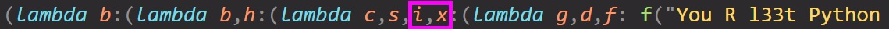

# Deobf Me

### Files

- [chall.py](chall.py)
- [compiler.py](compiler.py)


## Challenge Description

The symbols are speaking, what do they want?


## What I did

Idk if there was a shorter solution, if I did it by guessing some of the things by the names of the functions or parameters I would've solved it much faster, but I decided to translate every part of it so yah, long solution.


After reading the code, I found that the `initialize` is used to create the obfuscated code.

Some code and random variable names are formatted into `result`:  
```py
l = 'lambda'
char = str_to_chrs('chr','chr',str)
ladd1 = str_to_chrs('lambda a:a+1',c2,str)
ladd2 = str_to_chrs('lambda b:b+2',c2,str)
code = str_to_chrs(code,c4,eval_obf)
p = str_to_chrs('print',c4,str)
flag_obf = str_to_chrs(flag,c4,eval_obf)
result = f'({l} {c1}:({l} {c1},{c2}:({l} {c3},{c4},{c5},{c6}:(lambda {c7},{c8},{c9}: {c9}("You R l33t Python RE master.") if {c7}=={c8} else {c9}("Give it another try!"))({c3}({code}),{flag_obf},{c3}({p})))({c1},{c2},({c1}({ladd1})),({c1}({ladd2}))))({c1},{c1}({char})))(eval)'
```

What I did next was to refactor the result code which defined multiple lambda functions and calling them into a multiline version for readability:  
```py
def funcA(c1):
    def funcB(c1, c2):
        def funcC(c3, c4, c5, c6):
            def funcD(c7, c8, c9):
                if c7 == c8:
                    c9("You R l33 Python RE master.")
                else:
                    c9("Give it another try!")
            funcD(c3(code), flag_obf, c3(p))
        funcC(c1, c2, c1(ladd1), c1(ladd2))
    funcB(c1, c1(char))

funcA(eval)
```

And replaced the variable names for each level of function being called:  
```py
c1 = eval
def funcB(c1, c2):
    def funcC(c3, c4, c5, c6):
        def funcD(c7, c8, c9):
            if c7 == c8:
                c9("You R l33 Python RE master.")
            else:
                c9("Give it another try!")
        funcD(c3(code), flag_obf, c3(p))
    funcC(c1, c2, c1(ladd1), c1(ladd2))
funcB(c1, c1(char))
```

And so on:  
```py
c1 = eval
c2 = c1(char)  # eval(char)
def funcC(c3, c4, c5, c6):
    def funcD(c7, c8, c9):
        if c7 == c8:
            c9("You R l33 Python RE master.")
        else:
            c9("Give it another try!")
    funcD(c3(code), flag_obf, c3(p))
funcC(c1, c2, c1(ladd1), c1(ladd2))
```

```py
c1 = eval
c2 = eval(char)
c3 = c1
c4 = c2
c5 = c1(ladd1)  # eval(ladd1)
c6 = c1(ladd2)  # eval(ladd2)
def funcD(c7, c8, c9):
    if c7 == c8:
        c9("You R l33 Python RE master.")
    else:
        c9("Give it another try!")
funcD(c3(code), flag_obf, c3(p))
```

```py
c3 = c1 = eval
c4 = c2 = eval(char)
c5 = eval(ladd1)
c6 = eval(ladd2)
c7 = c3(code)   # eval(code)
c8 = flag_obf
c9 = c3(p)      # eval(p)
if c7 == c8:
    c9("You R l33 Python RE master.")
else:
    c9("Give it another try!")
```

Looking at the `str_to_chrs` function, it basically uses the litteral `chr` function (or `c2`, `c4`) and chains the result of the callable `obf_method` using `+` to create back the same string `x` that's being obfuscated. E.g.:  
```py
# This line:
str_to_chrs('chr','chr',str)

# Results in this:
chr(99)+chr(104)+chr(114)

# Which basically when run creates back this string:
"chr"
```

Continue my process of deobfuscating the `initialize` function:  
```py
code = 'input("Enter flag: ")'
char = str_to_chrs('chr','chr',str)
ladd1 = str_to_chrs('lambda a:a+1',c2,str)
ladd2 = str_to_chrs('lambda b:b+2',c2,str)
code = str_to_chrs(code,c4,eval_obf)
p = str_to_chrs('print',c4,str)
ifstr = str_to_chrs('if',c4,str)
flag_obf = str_to_chrs(flag,c4,eval_obf)
```

```py
code = 'input("Enter flag: ")'
char = chr
ladd1 = lambda a: a + 1
ladd2 = lambda b: b + 2
code = str_to_chrs(code,chr,eval_obf)      # Obsfucating the code using eval_obf
p = print
flag_obf = str_to_chrs(flag,chr,eval_obf)  # Obsfucating the flag using eval_obf
```

```py
code = 'input("Enter flag: ")'
char = chr
ladd1 = lambda a: a + 1
ladd2 = lambda b: b + 2
code = str_to_chrs(code,chr,eval_obf)
p = print
flag_obf = str_to_chrs(flag,chr,eval_obf)

c3 = c1 = eval
c4 = c2 = eval(char)
c5 = eval(ladd1)
c6 = eval(ladd2)
c7 = eval(code)
c8 = flag_obf
c9 = eval(p)
if c7 == c8:
    c9("You R l33 Python RE master.")
else:
    c9("Give it another try!")
```

```py
flag_obf = str_to_chrs(flag,chr,eval_obf)

c5 = lambda a: a + 1
c6 = lambda b: b + 2
c7 = input("Enter flag: ")
c8 = flag_obf
if c7 == c8:
    print("You R l33 Python RE master.")
else:
    print("Give it another try!")
```

```py
flag_obf = str_to_chrs(flag,chr,eval_obf)
c5 = lambda a: a + 1
c6 = lambda b: b + 2

if input("Enter flag: ") == flag_obf:
    print("You R l33 Python RE master.")
else:
    print("Give it another try!")
```

I scanned through the `eval_obf` function and concluded that it basically does bunch of magic to it's input and returns an output comprising of the 2 functions `c5` and `c6` that will eval back to the exactly the same output.

Looking at the [chall.py](chall.py), `c5` is with the name `i` and `c6` is with the name `x`:  

_*Also `c4` which is the `chr` function is given the name `s`_

Using my editor (which thankfully highlights corresponding brackets that my cursor is on), I found the portion of the code that contains the obfuscated `flag_obf`:  

So i assigned the names to the corresponding functions and got the flag:  
```py
s = chr
i = lambda a: a + 1
x = lambda b: b + 2

flag = s(i(x(i(x(i(x(x(i(i(i(i(i(i(x(i(i(x(i(i(x(x(x(x(x(i(i(i(x(i(i(x(i(x(x(x(x(x(x(i(x(x(i(x(x(i(x(i(x(x(i(i(1))))))))))))))))))))))))))))))))))))))))))))))))))))+s(i(x(i(x(x(i(i(x(x(x(i(i(i(x(i(x(i(i(i(i(x(x(i(x(i(x(i(x(x(i(i(x(x(x(i(x(i(i(x(x(x(x(x(x(x(i(x(i(x(i(x(i(x(x(i(i(x(i(0)))))))))))))))))))))))))))))))))))))))))))))))))))))))))))+s(i(x(i(x(x(x(i(x(x(x(i(x(i(i(x(i(x(i(x(x(x(i(i(x(x(i(i(i(i(i(x(x(x(x(x(i(i(i(x(x(x(i(i(i(i(i(x(x(x(i(i(i(i(1))))))))))))))))))))))))))))))))))))))))))))))))))))))+s(i(i(i(i(x(i(x(i(i(x(i(x(i(i(i(i(i(i(i(x(x(x(i(i(x(i(i(i(i(x(x(i(i(i(i(i(i(i(x(i(x(i(i(i(x(x(x(x(x(i(x(i(x(x(x(x(x(x(i(x(x(i(i(x(x(i(x(x(x(i(x(i(i(i(x(i(x(x(x(i(x(x(i(i(1)))))))))))))))))))))))))))))))))))))))))))))))))))))))))))))))))))))))))))))))))))))+s(i(x(x(i(i(x(i(x(x(i(i(i(x(x(x(x(i(x(i(x(i(x(x(i(i(x(i(x(x(i(x(i(i(x(i(x(x(x(i(i(x(x(x(i(i(i(x(x(i(i(x(x(i(x(i(i(x(x(x(x(i(i(x(x(x(x(x(x(x(i(x(i(x(i(i(i(i(0))))))))))))))))))))))))))))))))))))))))))))))))))))))))))))))))))))))))))))))+s(i(x(x(x(x(x(i(x(i(i(i(x(i(x(x(x(x(i(x(i(i(i(x(x(i(i(x(i(x(x(x(x(i(i(i(i(i(x(x(x(i(x(i(i(x(i(x(x(x(i(i(x(i(i(i(i(x(i(i(x(x(i(i(x(i(i(x(x(i(1))))))))))))))))))))))))))))))))))))))))))))))))))))))))))))))))))))))+s(x(i(i(i(i(i(x(i(x(i(i(i(i(i(i(i(i(x(i(i(i(i(i(x(x(i(x(x(i(x(i(x(x(x(i(x(x(i(0)))))))))))))))))))))))))))))))))))))))+s(i(x(i(x(i(i(i(x(i(x(x(i(x(x(i(i(x(i(i(i(x(i(i(x(x(x(i(x(x(x(x(x(x(x(x(x(i(i(i(x(i(i(x(i(i(x(x(x(x(i(i(x(i(i(x(0))))))))))))))))))))))))))))))))))))))))))))))))))))))))+s(i(i(i(x(x(x(x(i(i(i(x(x(i(x(x(i(x(i(x(i(x(x(i(i(x(i(i(x(i(x(i(x(x(i(i(x(i(x(i(x(i(x(x(x(x(i(i(x(x(x(i(x(i(x(x(x(i(i(i(i(i(x(1)))))))))))))))))))))))))))))))))))))))))))))))))))))))))))))))+s(i(x(x(i(x(x(x(i(i(i(i(x(i(x(x(x(x(i(x(i(i(x(i(x(x(x(i(x(i(i(x(x(x(i(x(i(i(x(i(x(x(i(x(i(x(i(i(i(i(i(i(i(x(i(i(i(x(i(i(i(i(i(x(x(x(x(i(1))))))))))))))))))))))))))))))))))))))))))))))))))))))))))))))))))))+s(i(x(x(i(i(i(x(i(x(x(i(x(x(i(x(i(x(x(x(x(i(i(x(i(x(i(i(i(i(x(i(i(1)))))))))))))))))))))))))))))))))+s(x(x(x(i(i(x(x(i(x(x(x(i(i(i(x(x(i(x(i(x(i(x(i(i(i(i(i(i(x(i(i(x(x(x(x(i(x(x(i(i(i(i(x(x(i(i(x(x(x(i(i(x(i(x(x(i(i(x(x(x(i(x(i(i(i(i(x(i(x(i(x(x(i(i(0)))))))))))))))))))))))))))))))))))))))))))))))))))))))))))))))))))))))))))+s(i(i(x(x(i(i(x(x(x(i(i(x(x(i(i(i(i(x(x(x(x(x(i(x(i(i(x(x(x(x(i(i(i(x(x(i(x(i(i(i(x(i(x(i(i(x(1)))))))))))))))))))))))))))))))))))))))))))))))+s(i(i(i(x(i(x(x(x(x(x(i(x(x(i(x(i(x(i(x(i(x(x(x(i(x(i(x(i(x(x(i(x(x(x(x(i(i(i(i(x(i(i(i(i(x(x(x(x(i(i(x(x(i(i(x(0))))))))))))))))))))))))))))))))))))))))))))))))))))))))+s(i(i(x(x(x(i(i(x(i(i(i(x(i(x(x(i(x(i(i(i(x(x(x(i(i(x(i(i(x(x(x(i(i(x(i(x(i(x(x(i(x(i(i(i(x(i(x(i(i(i(i(i(i(x(x(x(i(i(0)))))))))))))))))))))))))))))))))))))))))))))))))))))))))))+s(i(i(i(i(i(i(i(i(i(x(x(x(x(i(i(i(i(i(x(x(x(i(x(x(i(x(x(i(x(i(x(x(x(i(0)))))))))))))))))))))))))))))))))))+s(i(x(i(i(x(x(x(i(i(x(x(i(x(x(i(x(i(i(x(i(x(x(i(x(i(i(i(x(i(i(i(x(i(x(x(x(x(i(i(i(i(i(i(x(x(i(i(x(i(i(i(x(i(x(i(x(i(i(x(i(i(x(x(i(x(x(x(i(i(x(i(x(x(x(1)))))))))))))))))))))))))))))))))))))))))))))))))))))))))))))))))))))))))))+s(i(x(x(x(x(x(i(x(x(x(x(i(i(i(i(i(x(i(i(x(i(i(i(x(x(x(i(i(i(x(x(x(i(i(i(i(i(i(i(i(x(i(x(i(x(x(i(i(x(x(i(i(i(x(x(x(i(i(x(i(x(i(x(x(x(x(x(i(i(1))))))))))))))))))))))))))))))))))))))))))))))))))))))))))))))))))))))+s(i(x(x(x(x(i(x(i(i(x(x(x(x(x(x(i(x(i(i(i(i(i(i(x(x(x(x(i(x(x(x(x(x(x(x(i(i(x(x(x(i(x(i(i(i(i(i(i(i(x(i(x(x(x(x(i(i(x(i(x(1)))))))))))))))))))))))))))))))))))))))))))))))))))))))))))))+s(i(i(i(x(i(i(x(i(x(i(i(x(i(x(i(i(i(x(x(x(x(x(i(i(x(i(x(i(x(x(x(x(i(i(i(i(i(x(i(x(i(i(x(x(i(i(x(x(i(x(x(x(i(i(i(x(i(x(i(i(x(x(i(x(x(i(x(x(x(i(i(i(x(x(i(i(i(x(0)))))))))))))))))))))))))))))))))))))))))))))))))))))))))))))))))))))))))))))))+s(i(i(x(i(i(i(i(x(i(x(x(x(x(i(x(x(x(x(x(x(x(i(x(x(i(x(x(x(i(i(x(x(x(i(x(i(i(x(i(i(i(x(x(x(i(i(x(i(x(x(i(i(i(x(x(x(i(0))))))))))))))))))))))))))))))))))))))))))))))))))))))))))+s(x(x(x(x(x(i(i(x(x(i(x(x(i(x(x(i(x(i(i(x(i(i(i(i(x(i(x(i(x(i(i(i(x(i(i(x(x(x(x(i(i(x(x(x(i(i(i(x(i(x(1)))))))))))))))))))))))))))))))))))))))))))))))))))+s(x(x(x(i(x(i(x(i(x(i(x(x(i(x(x(x(i(x(i(i(x(x(x(x(i(x(i(x(i(i(x(i(i(i(i(i(i(i(x(i(x(i(i(x(i(i(x(x(i(x(i(x(x(i(x(x(i(x(x(x(x(i(i(i(i(0))))))))))))))))))))))))))))))))))))))))))))))))))))))))))))))))))+s(x(x(x(i(x(x(i(x(i(x(x(i(x(x(i(i(x(i(x(x(i(i(x(i(i(i(x(i(x(x(1)))))))))))))))))))))))))))))))+s(x(i(x(i(i(x(x(i(i(x(x(x(x(x(i(i(i(i(x(i(x(x(i(x(i(x(x(i(i(i(i(x(x(x(x(i(x(i(i(i(x(i(x(x(i(x(x(x(x(x(x(i(i(i(x(x(x(x(x(x(i(i(i(x(x(x(i(x(1)))))))))))))))))))))))))))))))))))))))))))))))))))))))))))))))))))))+s(i(i(x(i(x(x(x(x(i(x(i(x(i(x(x(x(x(i(i(i(x(x(i(x(i(x(i(i(x(x(i(x(x(1))))))))))))))))))))))))))))))))))+s(x(i(i(i(x(x(x(x(x(i(x(x(x(i(x(x(x(x(i(x(x(i(i(x(x(i(x(x(x(i(x(i(i(x(i(i(x(i(i(i(i(x(i(i(x(x(i(i(i(i(x(i(x(i(i(i(i(x(i(i(i(x(i(i(1)))))))))))))))))))))))))))))))))))))))))))))))))))))))))))))))))+s(i(x(i(x(i(x(x(x(x(x(x(x(i(i(i(x(x(i(i(x(x(x(i(i(x(i(x(i(x(i(x(x(i(i(i(i(i(1))))))))))))))))))))))))))))))))))))))+s(x(x(x(i(i(x(x(i(i(x(x(x(x(i(i(i(x(i(i(x(i(x(i(x(i(i(x(x(i(x(x(1))))))))))))))))))))))))))))))))+s(x(x(i(x(i(x(x(x(x(i(i(x(x(i(i(x(i(x(x(i(x(x(i(x(i(x(x(i(x(x(x(0))))))))))))))))))))))))))))))))+s(x(x(x(i(x(x(x(i(x(x(x(x(x(i(i(x(x(i(x(x(x(x(x(i(i(i(i(x(i(i(x(x(i(x(1)))))))))))))))))))))))))))))))))))+s(i(x(i(i(i(i(x(x(i(x(x(i(i(x(i(i(x(i(i(i(i(x(x(x(i(x(x(i(i(x(i(x(x(i(i(i(i(i(x(x(x(x(i(i(i(x(i(x(i(x(i(i(i(x(x(i(x(x(i(i(i(i(i(i(x(x(i(x(i(i(x(i(i(x(i(i(x(i(i(x(x(i(i(1))))))))))))))))))))))))))))))))))))))))))))))))))))))))))))))))))))))))))))))))))))+s(i(x(x(i(x(x(i(x(i(i(x(x(x(i(i(x(x(i(i(i(i(i(x(x(x(i(x(i(i(x(i(x(x(i(x(x(i(i(x(x(x(i(i(i(x(x(i(i(i(i(i(x(i(i(i(x(i(i(x(x(x(x(i(i(i(x(i(i(i(i(i(i(x(x(i(i(i(x(i(x(x(1))))))))))))))))))))))))))))))))))))))))))))))))))))))))))))))))))))))))))))))))))+s(i(x(i(x(x(i(x(x(x(i(x(i(x(i(x(x(x(x(i(x(x(i(i(x(x(x(i(i(i(i(i(x(x(x(x(i(x(x(x(x(i(x(x(i(x(i(i(x(x(i(i(i(1)))))))))))))))))))))))))))))))))))))))))))))))))))))+s(i(i(i(x(x(x(x(i(i(i(x(x(i(i(i(i(x(x(i(x(i(x(i(i(i(i(x(i(i(i(x(i(i(i(i(i(i(0))))))))))))))))))))))))))))))))))))))+s(i(i(x(i(x(i(i(x(i(i(i(x(x(x(i(i(x(i(x(i(x(x(i(i(i(x(i(x(i(i(i(i(i(x(x(i(i(i(x(x(i(i(i(i(x(i(x(x(i(i(i(i(x(i(x(x(x(i(i(x(x(x(i(i(i(x(x(x(x(i(x(0))))))))))))))))))))))))))))))))))))))))))))))))))))))))))))))))))))))))+s(x(i(i(i(x(i(x(i(i(i(x(i(i(i(i(i(i(i(x(x(x(i(i(x(x(i(x(i(i(i(x(x(x(x(i(i(i(x(x(i(i(i(x(x(i(i(x(i(x(x(x(i(i(x(x(i(x(i(x(x(i(i(i(x(x(i(x(i(i(i(x(x(x(x(x(i(i(x(x(i(x(x(i(x(1)))))))))))))))))))))))))))))))))))))))))))))))))))))))))))))))))))))))))))))))))))))

print(flag)
```

Flag Captured: `NYP{wh4T_c0nFUS1ng_sYMb0l5_9139vvS1f}`
