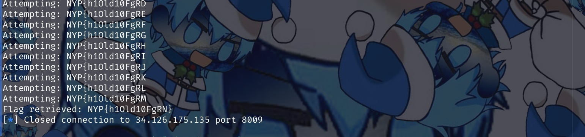

# ECB Xoracle

### Files

- [chall.py](chall.py)


## Challenge Description

I implemented an additional step in my encryption/decryption service and declare its name as "Xoracle". It should be more secure, right?


## Understanding the code

The name of the challenge "**Xor**acle" suggests that the key to solving the challenge is related to the XOR function.

The encryption service uses a new random key for every encryption, this suggests that we do not need to "crack" AES encryption.

Also note that AES is in [ECB mode](https://en.wikipedia.org/wiki/Block_cipher_mode_of_operation#Electronic_codebook_(ECB)), meaning that if 2 16 bytes blocks of the `pt` were of the same value, their encrypted output will also be the same.

`encrypt` function logic:  
```AES_ECB( xor_ecb(pt, flag) )```

In the `xor_ecb` function, every 16 bytes block of `pt` is being XORed with one character of the `flag`, which is being iterated through for each nth block.

This means that the 1st block will XOR with the 1st character of the flag, the 2nd block will XOR with the 2nd character of the flag, and so on...


## Deriving the flag

Note that XOR of the same values results in null bytes.

Knowing that the flag format of the CTF is `NYP{some_text}`, we know that the first 4 bytes of the flag is `NYP{`

This means that encrypting `NNNNNNNNNNNNNNNNYYYYYYYYYYYYYYYY` would result in 2 blocks of encrypted data of the same value.

This is beacuse:  
- The 1st block (where `N` is at) will XOR with the 1st char of the flag `N` resulting in null bytes
- The 2nd block (where `Y` is at) will XOR with the 2nd char of the flag `Y` resulting in null bytes

So I can craft my payload to guess the next unknown character of the flag, by comparing the encrypted value of the block containing the a known character of the flag, and the encrypted value of the block containing the guessed character of the flag.


## Solution

Wrote a [script](script.py) to automate the guessing of the flag:

```py
import string
from pwn import b64d, remote

FLAG_LEN = 16
BLOCK_SIZE = 16

HOST = "34.126.175.135"
PORT = 8009

conn = remote(HOST, PORT)

def send(pt):
    conn.recv()  # Recieve prompt
    conn.sendline(pt)
    return conn.recvline().decode()

def one_attempt(incomplete):
    pt = "".join(char*16 for char in incomplete) + "A"  # Extra to ensure pt%16>0
    received = send(pt.encode())
    result = b64d(received.replace(">", "").strip())
    return result[:BLOCK_SIZE] == result[-(BLOCK_SIZE*2):-BLOCK_SIZE]

def solve():
    incomplete = list("NYP{")  # Flag should be of `NYP{...}` format
    for _ in range(FLAG_LEN-len(incomplete)-1):
        incomplete.append("")
        for char in string.printable:
            print(f"Attempting: {''.join(incomplete)}")
            incomplete[-1] = char
            yes = one_attempt(incomplete)
            send(b"next")  # Skip to encrypt again
            if yes: break
    return "".join(incomplete) + "}"

conn.recv()  # Recieve banner

flag = solve()
print(f"Flag retrieved: {flag}")
```

Output:  


Flag Captured: `NYP{h1Old10FgRN}`
