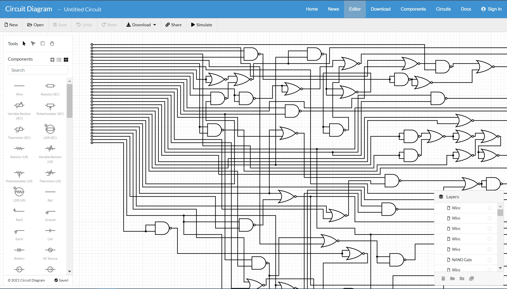
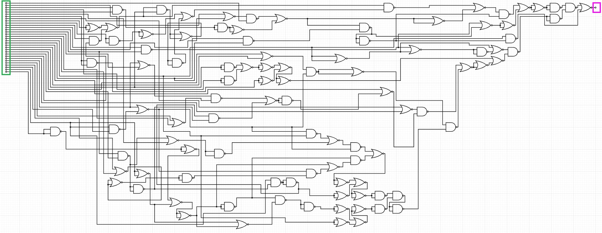
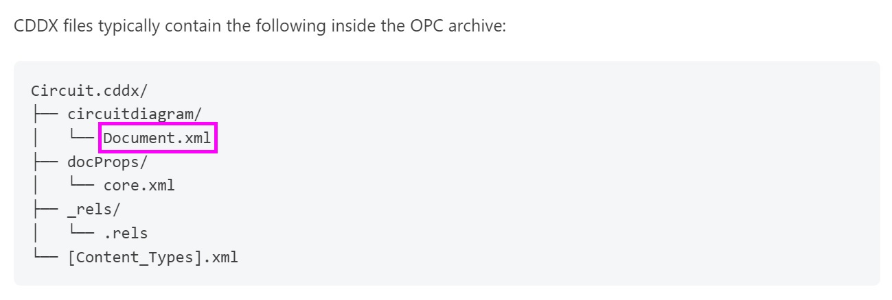
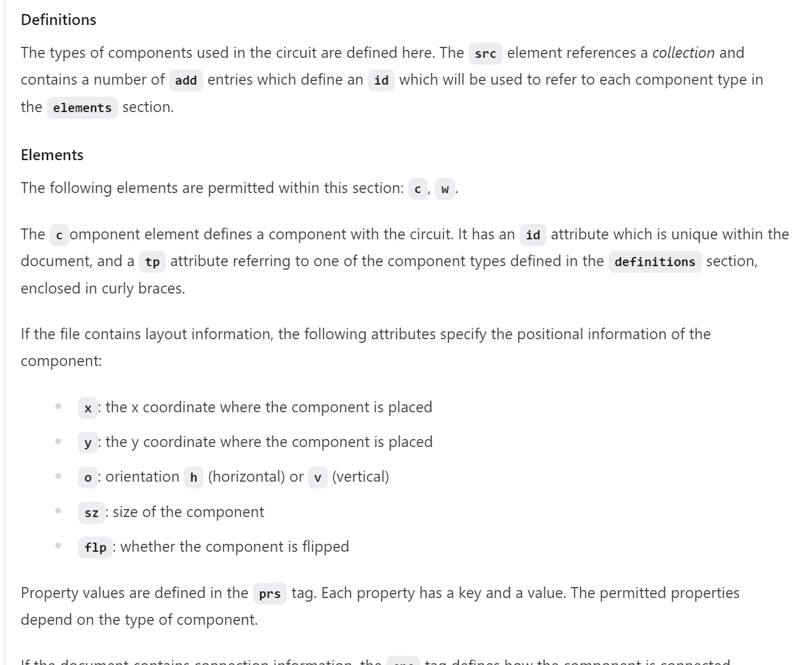

# Nandy & Nory


### Files

- [challenge.cddx](challenge.cddx)


## Description

Nandy: Nory! What's the password??!?  
Nory:  It's ████████████████████████████████  
Nandy: How do I enter it?  
Nory:  Oh just enter the 1s and 0s for the inputs at the left in the correct combination.  
\* One thousand three hundred and sixty-one years later...  
Nandy: Ok, is this correct?  
Nory:  Yep, it's correct if the output at the right is 1.  

Note: Enter the flag in the format LNC2023{...} where ... is the inputs such that True is 1 and False is 0.

E.g.: LNC2023{101} means the 1st input (at the top) must be True, the 2nd input (in the middle) must be False, and the 3rd input (at the bottom) must be True, for the output at the right to be True.

P.S. I hope you suffer twice as much as what I went through drawing this thing manually.


## Intended Solution

1. Players are given a `challenge.cddx` file. They are required to search the web and find out that CDDX is a format used to store circuit diagrams created using the circuit editor [circuit-diagram.org](circuit-diagram.org)  


2. The file could be imported using the [online editor](circuit-diagram.org/editor). Upon importing the file, players would be greeted with the following ~~nonsensical~~ circuit.  
~~Players are expected to stay calm and not give up on the challenge when they see this.~~  


3. To get the flag, players have to find the correct combination of True and False boolean values in the inputs on the left (in green box) that will result in a True value in the output on the right (in magenta box).  


4. A very detailedy written [documentation](circuit-diagram.org/docs/cddx) of the CDDX file format is provided. From there, players can unzip the `challenge.cddx` file and find the contents of the circuit in the `circuitdiagram/Document.xml` file. The definitions of each tag and attributes are also defined.  
  


5. Next players can use python to parse the XML file to trace the entire circuit starting from the output and solve it using a SAT solver.

6. Players may (and are also encouraged to) create a smaller circuit diagram using the same editor, and create a working parser for that smaller circuit first before using the script on the actual circuit.

7. Players would have to read the documentations and use the self created smaller-scaled circuit to understand how to parse the XML file.


### Possible steps to solve the challenge:

1. Parse the XML and store the different components in variables to be used later.  
```py
import xml.etree.ElementTree as ET

NAMESPACES = {
    "cddx": "http://schemas.circuit-diagram.org/circuitDiagramDocument/2012/document"
}

tree = ET.parse("Document.xml")
root = tree.getroot()
components = root.findall("cddx:elements/cddx:c", namespaces=NAMESPACES)
```

2. From the `definitions` element, we could see the unique id for NAND is 0, NOR is 1, External connections are 2.  
A map variable to be used for parsing:  
```py
ELEMENT_ID = {
    "{0}": "NAND",
    "{1}": "NOR",
    "{2}": "CONN"
}
```

3. External connections represents both inputs and outputs, inputs has the `v="False"` while outputs has `v="True"`. Also the output is the only one at the far right, so it can be identified using it's x coordinate too.  
```xml
<c id="131" tp="{2}" x="2690" y="60" o="h" sz="10" flp="false">
    <prs>
        <p k="text" v="" />
        <p k="textpos" v="True" />
    </prs>
    <cns>
        <cn id="131" pt="com" />
    </cns>
</c>
```

4. Loop through the components and store the inputs, outputs and connections in variables:  
```py
output = None
inputs = []
connections = {}

# Loop through all components and add them to variables
for c in components:
    cns = c.findall("cddx:cns/cddx:cn", namespaces=NAMESPACES)
    c_type = ELEMENT_ID[c.attrib["tp"]]

    if c_type == "CONN":

        # There's more than one way to determine the output
        # One of the easier ways is to just check the x coordinates
        if c.attrib["x"] == "2690":  # OUTPUT
            output = c
        else:                        # INPUT
            inputs.append(c)
            for cn in cns:
                temp = connections.get(cn.attrib["id"], [])
                temp.append(c)
                connections[cn.attrib["id"]] = temp

    elif c_type == "NAND":           # NAND
        for cn in cns:
            if cn.attrib["pt"] == "out":
                temp = connections.get(cn.attrib["id"], [])
                temp.append(c)
                connections[cn.attrib["id"]] = temp

    elif c_type == "NOR":            # NOR
        for cn in cns:
            if cn.attrib["pt"] == "out":
                temp = connections.get(cn.attrib["id"], [])
                temp.append(c)
                connections[cn.attrib["id"]] = temp
```

5. Inputs should be ordered by their y coordinate (top is first, bottom is last). Sort the list of inputs:  
```py
inputs.sort(key=lambda c: int(c.attrib["y"]))
```

6. Strategy: trace the circuit starting from the final output using a recursive function.

7. To solve the ciruit I'll be using z3 (any SAT solver will do):  
```py
from z3 import And, Bool, Not, Or, Solver

# Self defined NAND and NOR for convenience
def Nand(a, b):
    return Not(And(a, b))

def Nor(a, b):
    return Not(Or(a, b))
```

8. Recursive function to trace and find the connected connections given the component:  
```py
def trace_c(c):  # Trace and attempts to solve the selected component (c)
    cns = c.findall("cddx:cns/cddx:cn", namespaces=NAMESPACES)
    if c is output:
        return trace_cn(cns[0])

    elif c in inputs:
        return Bool(str(inputs.index(c)))

    temp = []

    for cn in cns:
        if cn.attrib["pt"] != "out":
            temp.append(cn)

    c_type = ELEMENT_ID[c.attrib["tp"]]

    if c_type == "NAND":
        return Nand(trace_cn(temp[0]), trace_cn(temp[1]))
    elif c_type == "NOR":
        return Nor(trace_cn(temp[0]), trace_cn(temp[1]))
```

9. Recursive function to trace and find the connected components given the connection:  
```py
def trace_cn(cn): # Trace and attempts to solve the selected connection (cn)
    cs = connections[cn.attrib["id"]]
    if len(cs) > 1:
        return Or(*[trace_c(c) for c in cs])
    return trace_c(cs[0])
```

10. Trace circuit starting from the output:  
```py
circuit = trace_c(output)
```

11. Solve the ciruit using a SAT solver:  
```py
from z3 import solve
solve(circuit)
```
Output:  
```
[31 = False,
 30 = True, 
 13 = True, 
 17 = True, 
 10 = True, 
 21 = True, 
 15 = False,
 7 = False,
 23 = True,
 5 = False,
 6 = False,
 26 = False,
 8 = True,
 0 = True,
 2 = True,
 12 = False,
 3 = True,
 16 = False,
 28 = False,
 14 = False,
 27 = False,
 29 = True,
 22 = False,
 9 = False,
 11 = True,
 1 = False,
 25 = False,
 19 = False,
 24 = True,
 4 = True,
 18 = False,
 20 = False]
```

12. You can choose to sort and format the above output manually. Or be like me and write the code to format the output 🙃:  
```py
# Solve the circuit using z3
s = Solver()
s.add(circuit)
r = s.check()

# Formatting the flag
model = s.model()
decls = model.decls()
decls.sort(key=lambda x: int(str(x)))
results = ["01"[bool(model.get_interp(i))] for i in decls]
flag = "LNC2023{" + "".join(results) + "}"

print(flag)  # LNC2023{10111000101101000100010110000110}

```


## Flag

`LNC2023{10111000101101000100010110000110}`


## Random notes

This challenge was basically a simplified version of a google CTF challenge. If you watched enough [random youtube videos](https://www.youtube.com/watch?v=nI8Q1bqT8QU) you'd have been able to solve this challenge.

TL;DR: watch more random youtube videos.
